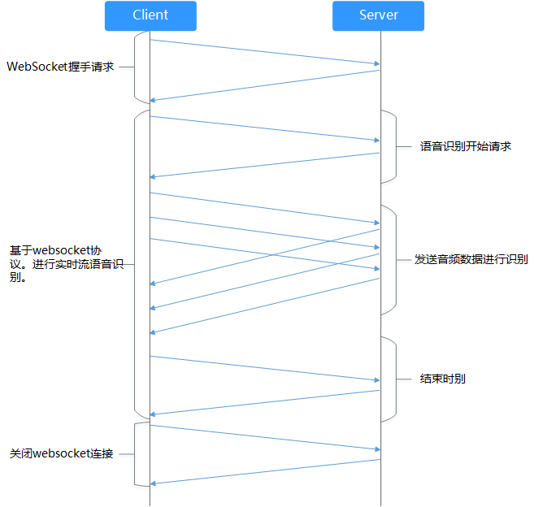

# WebSocket介绍

## 前提条件

在调用实时语音转写的websocket接口之前，您需要完成Token认证，详细操作指导请参见[认证鉴权](认证鉴权.md)。

## 接口使用介绍

实时语音转写接口使用websocket协议承载，客户端与服务端交流流程如[图1](#fig594742110162)所示，分为三个主要步骤：

1.  WebSocket握手。
2.  基于WebSocket协议进行实时语音转写。
3.  关闭WebSocket连接。

其中基于WebSocket协议进行实时语音转写时，需要客户端首先发送转写开始消息，然后持续发送语音数据至服务端，最后发送结束消息，在此期间客户端会持续收到服务端发送的转写结果或事件，客户端根据所收到的相应消息做对应处理。实时语音转写接口的具体细节请参见[接口说明](接口说明.md)章节。

**图 1**  客户端与服务端交流流程  

