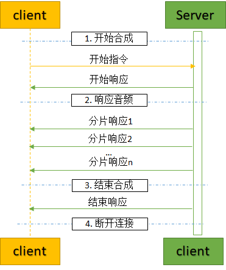

# Websocket握手请求<a name="sis_03_0113"></a>

## 功能介绍<a name="section2094332416240"></a>

本接口提供实时流式语音合成。用户每次建立连接，发送待合成文本，服务端将合成结果响应给用户。一次连接只能发送一次文本，如果有多段文本需要合成，需要多次建立连接。实时语音合成和语音合成均属于语音合成接口，采用完全相同的计费规则，两者价格梯度可互相叠加，可参考[价格计算器](https://www.huaweicloud.com/pricing.html?tab=calculator#/sis)。

## 工作流程<a name="section189401366533"></a>

从流程图可以看出，实时语音合成只需要发送1次开始请求，会陆续收到开始响应、合成音频的分片响应、结束响应。



## wss-URI<a name="section4427173121418"></a>

-   wss-URI格式

    wss /v1/\{project\_id\}/rtts

-   参数说明

    **表 1**  参数说明

    <a name="table095222412411"></a>
    <table><thead align="left"><tr id="row961250244"><th class="cellrowborder" valign="top" width="27.432743274327432%" id="mcps1.2.4.1.1"><p id="p13622517242"><a name="p13622517242"></a><a name="p13622517242"></a>名称</p>
    </th>
    <th class="cellrowborder" valign="top" width="24.08240824082408%" id="mcps1.2.4.1.2"><p id="p66625142420"><a name="p66625142420"></a><a name="p66625142420"></a>是否必选</p>
    </th>
    <th class="cellrowborder" valign="top" width="48.484848484848484%" id="mcps1.2.4.1.3"><p id="p86525192413"><a name="p86525192413"></a><a name="p86525192413"></a>说明</p>
    </th>
    </tr>
    </thead>
    <tbody><tr id="row6622514241"><td class="cellrowborder" valign="top" width="27.432743274327432%" headers="mcps1.2.4.1.1 "><p id="p1871725122414"><a name="p1871725122414"></a><a name="p1871725122414"></a>project_id</p>
    </td>
    <td class="cellrowborder" valign="top" width="24.08240824082408%" headers="mcps1.2.4.1.2 "><p id="p197425112415"><a name="p197425112415"></a><a name="p197425112415"></a>是</p>
    </td>
    <td class="cellrowborder" valign="top" width="48.484848484848484%" headers="mcps1.2.4.1.3 "><p id="p47162572418"><a name="p47162572418"></a><a name="p47162572418"></a>项目编号。获取方法，请参见<a href="获取项目ID.md">获取项目ID</a>。</p>
    </td>
    </tr>
    </tbody>
    </table>

-   请求示例（伪码）

    ```
    wss://{endpoint}/v1/{project_id}/rtts
    
    Request Header:
    X-Auth-Token: MIINRwYJKoZIhvcNAQcCoIINODCCDTQCAQExDTALBglghkgBZQMEAgEwgguVBgkqhkiG...
    ```

    Python3语言请求代码示例

    ```
    # -*- coding: utf-8 -*-
    # 此demo仅供测试使用，强烈建议使用sdk。需提前安装websocket-client, 执行pip install websocket-client
    import websocket
    import threading
    import time
    import json
    
    
    def rtts_demo():
        url = 'wss://{{endpoint}}/v1/{{project_id}}/rtts'  # endpoint和project_id需替换
        text = '待合成文本'
        token = '用户对应region的token'
        header = {
            'X-Auth-Token': token
        }
    
        body = {
            'command': 'START',
            'text': text,
            'config': {
                'audio_format': 'pcm',
                'property': 'chinese_xiaoyu_common',
                'sample_rate': '8000'
            }
        }
    
        def _on_message(ws, message):
            if isinstance(message, bytes):
                print('receive data length %d' % len(message))
            else:
                print(message)
    
        def _on_error(ws, error):
            print(error)
    
        ws = websocket.WebSocketApp(url, header, on_message=_on_message, on_error=_on_error)
        _thread = threading.Thread(target=ws.run_forever, args=(None, None, 30, 20))
        _thread.start()
        time.sleep(1)
        ws.send(json.dumps(body), opcode=websocket.ABNF.OPCODE_TEXT)
        time.sleep(10)
        ws.close()
    
    
    if __name__ == '__main__':
        rtts_demo()
    
    ```

    Java语言请求代码示例

    ```
    import okhttp3.OkHttpClient;
    import okhttp3.Request;
    import okhttp3.Response;
    import okhttp3.WebSocket;
    import okhttp3.WebSocketListener;
    import okio.ByteString;
    
    /**
     * 此demo仅供测试使用, 强烈建议使用sdk
     * 使用前需已配置okhttp、okio jar包。jar包可通过下载SDK获取。
     */
    public class RttsDemo {
      public void rttsDemo() {
        try {
          // endpoint和projectId需要替换成实际信息。
          String url = "wss://{{endpoint}}/v1/{{project_id}}/rtts";
          String token = "对应region的token";
          String text = "待合成文本";
          OkHttpClient okHttpClient = new OkHttpClient();
          Request request = new Request.Builder().url(url).header("X-Auth-Token", token).build();
          WebSocket webSocket = okHttpClient.newWebSocket(request, new MyListener());
          webSocket.send("{\"command\": \"START\", \"text\":\"" + text
              + "\", \"config\": {\"audio_format\": \"pcm\", \"property\": \"chinese_xiaoyu_common\"}}");
          Thread.sleep(10000);
          webSocket.close(1000, null);
    
        } catch (Exception e) {
          e.printStackTrace();
        }
    
      }
    
      class MyListener extends WebSocketListener {
        @Override
    
        public void onOpen(WebSocket webSocket, Response response) {
          System.out.println("conneected");
        }
    
        @Override
        public void onClosed(WebSocket webSocket, int code, String reason) {
          System.out.println("closed");
        }
    
        @Override
        public void onFailure(WebSocket webSocket, Throwable t, Response response) {
          t.printStackTrace();
        }
    
        @Override
        public void onMessage(WebSocket webSocket, String text) {
          System.out.println(text);
        }
    
        public void onMessage(WebSocket webSocket, ByteString bytes) {
          byte[] data = bytes.toByteArray();
          System.out.println("receive data length is " + data.length);
        }
    
      }
    
      public static void main(String[] args) {
        RttsDemo rttsDemo = new RttsDemo();
        rttsDemo.rttsDemo();
      }
    }
    
    ```


