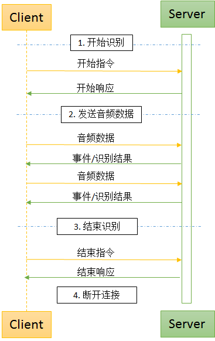

# websocket接口<a name="sis_03_0095"></a>

## 功能介绍<a name="section135312418516"></a>

一句话识别websocket接口支持识别1min以内的音频，交互过程如[图 客户端和服务端交互流程](#fig3865114218578)所示，主要分为开始识别、发送音频数据，结束识别、断开连接四个步骤。

websocket接口同http接口一致按次计费，只要建立连接成功，发送音频，服务开始识别，则本次调用计费生效。如果用户发送错误end请求或者持续20s未发送音频而产生了报错，该次调用依然认为生效。如果连接成功后未发送音频直接断开，或者请求字段不正确而产生异常，则认为本次调用无效，不会纳入计费次数。

**图 1**  客户端和服务端交互流程<a name="fig3865114218578"></a>  


## wss-URI<a name="section13711193213106"></a>

-   wss-URI格式

    wss /v1/\{project\_id\}/asr/short-audio

-   参数说明

    **表 1**  参数说明

    <a name="zh-cn_topic_0145253499_table60557318"></a>
    <table><thead align="left"><tr id="zh-cn_topic_0145253499_row38729025"><th class="cellrowborder" valign="top" width="35.35353535353536%" id="mcps1.2.4.1.1"><p id="zh-cn_topic_0145253499_p50043331"><a name="zh-cn_topic_0145253499_p50043331"></a><a name="zh-cn_topic_0145253499_p50043331"></a>参数名</p>
    </th>
    <th class="cellrowborder" valign="top" width="16.16161616161616%" id="mcps1.2.4.1.2"><p id="zh-cn_topic_0145253499_p26978034"><a name="zh-cn_topic_0145253499_p26978034"></a><a name="zh-cn_topic_0145253499_p26978034"></a>是否必选</p>
    </th>
    <th class="cellrowborder" valign="top" width="48.484848484848484%" id="mcps1.2.4.1.3"><p id="zh-cn_topic_0145253499_p37737141"><a name="zh-cn_topic_0145253499_p37737141"></a><a name="zh-cn_topic_0145253499_p37737141"></a>说明</p>
    </th>
    </tr>
    </thead>
    <tbody><tr id="zh-cn_topic_0145253499_row43751799"><td class="cellrowborder" valign="top" width="35.35353535353536%" headers="mcps1.2.4.1.1 "><p id="zh-cn_topic_0145253499_p54234863"><a name="zh-cn_topic_0145253499_p54234863"></a><a name="zh-cn_topic_0145253499_p54234863"></a>project_id</p>
    </td>
    <td class="cellrowborder" valign="top" width="16.16161616161616%" headers="mcps1.2.4.1.2 "><p id="zh-cn_topic_0145253499_p30947767"><a name="zh-cn_topic_0145253499_p30947767"></a><a name="zh-cn_topic_0145253499_p30947767"></a>是</p>
    </td>
    <td class="cellrowborder" valign="top" width="48.484848484848484%" headers="mcps1.2.4.1.3 "><p id="zh-cn_topic_0145253499_p23741175"><a name="zh-cn_topic_0145253499_p23741175"></a><a name="zh-cn_topic_0145253499_p23741175"></a>项目编号。获取方法，请参见<a href="获取项目ID.md">获取项目ID</a>。</p>
    </td>
    </tr>
    </tbody>
    </table>


## 开始识别<a name="section6958051195119"></a>

-   功能介绍

    当wss握手请求收到成功响应后，客户端到服务端的通信协议会升级为Websocket协议。通过Websocket协议，客户端发送开始识别请求，用于配置一句话识别的配置信息。

-   请求消息

    **表 2**  参数说明

    <a name="zh-cn_topic_0145253456_table51565033"></a>
    <table><thead align="left"><tr id="zh-cn_topic_0145253456_row19577827"><th class="cellrowborder" valign="top" width="25.58255825582558%" id="mcps1.2.5.1.1"><p id="zh-cn_topic_0145253456_p42300179"><a name="zh-cn_topic_0145253456_p42300179"></a><a name="zh-cn_topic_0145253456_p42300179"></a>参数名</p>
    </th>
    <th class="cellrowborder" valign="top" width="11.621162116211622%" id="mcps1.2.5.1.2"><p id="zh-cn_topic_0145253456_p36326405"><a name="zh-cn_topic_0145253456_p36326405"></a><a name="zh-cn_topic_0145253456_p36326405"></a>是否必选</p>
    </th>
    <th class="cellrowborder" valign="top" width="16.28162816281628%" id="mcps1.2.5.1.3"><p id="zh-cn_topic_0145253456_p56757654"><a name="zh-cn_topic_0145253456_p56757654"></a><a name="zh-cn_topic_0145253456_p56757654"></a>参数类型</p>
    </th>
    <th class="cellrowborder" valign="top" width="46.514651465146514%" id="mcps1.2.5.1.4"><p id="zh-cn_topic_0145253456_p33967256"><a name="zh-cn_topic_0145253456_p33967256"></a><a name="zh-cn_topic_0145253456_p33967256"></a>说明</p>
    </th>
    </tr>
    </thead>
    <tbody><tr id="zh-cn_topic_0145253456_row66993202"><td class="cellrowborder" valign="top" width="25.58255825582558%" headers="mcps1.2.5.1.1 "><p id="zh-cn_topic_0145253456_p57740301"><a name="zh-cn_topic_0145253456_p57740301"></a><a name="zh-cn_topic_0145253456_p57740301"></a>command</p>
    </td>
    <td class="cellrowborder" valign="top" width="11.621162116211622%" headers="mcps1.2.5.1.2 "><p id="zh-cn_topic_0145253456_p4581796"><a name="zh-cn_topic_0145253456_p4581796"></a><a name="zh-cn_topic_0145253456_p4581796"></a>是</p>
    </td>
    <td class="cellrowborder" valign="top" width="16.28162816281628%" headers="mcps1.2.5.1.3 "><p id="zh-cn_topic_0145253456_p35581233"><a name="zh-cn_topic_0145253456_p35581233"></a><a name="zh-cn_topic_0145253456_p35581233"></a>String</p>
    </td>
    <td class="cellrowborder" valign="top" width="46.514651465146514%" headers="mcps1.2.5.1.4 "><p id="zh-cn_topic_0145253456_p63507614"><a name="zh-cn_topic_0145253456_p63507614"></a><a name="zh-cn_topic_0145253456_p63507614"></a>需设置为START，表示开始识别请求。</p>
    </td>
    </tr>
    <tr id="zh-cn_topic_0145253456_row34697616"><td class="cellrowborder" valign="top" width="25.58255825582558%" headers="mcps1.2.5.1.1 "><p id="zh-cn_topic_0145253456_p59043505"><a name="zh-cn_topic_0145253456_p59043505"></a><a name="zh-cn_topic_0145253456_p59043505"></a>config</p>
    </td>
    <td class="cellrowborder" valign="top" width="11.621162116211622%" headers="mcps1.2.5.1.2 "><p id="zh-cn_topic_0145253456_p32073719"><a name="zh-cn_topic_0145253456_p32073719"></a><a name="zh-cn_topic_0145253456_p32073719"></a>是</p>
    </td>
    <td class="cellrowborder" valign="top" width="16.28162816281628%" headers="mcps1.2.5.1.3 "><p id="zh-cn_topic_0145253456_p47834478"><a name="zh-cn_topic_0145253456_p47834478"></a><a name="zh-cn_topic_0145253456_p47834478"></a>Object</p>
    </td>
    <td class="cellrowborder" valign="top" width="46.514651465146514%" headers="mcps1.2.5.1.4 "><p id="zh-cn_topic_0145253456_p49387472"><a name="zh-cn_topic_0145253456_p49387472"></a><a name="zh-cn_topic_0145253456_p49387472"></a>配置信息。结构信息请参见<a href="#zh-cn_topic_0145253456_table20477121925620">表 config数据结构</a>。</p>
    </td>
    </tr>
    </tbody>
    </table>

    **表 3**  config数据结构

    <a name="zh-cn_topic_0145253456_table20477121925620"></a>
    <table><thead align="left"><tr id="zh-cn_topic_0145253456_row83331040175813"><th class="cellrowborder" valign="top" width="25.57255725572557%" id="mcps1.2.5.1.1"><p id="zh-cn_topic_0145253456_p6334940195815"><a name="zh-cn_topic_0145253456_p6334940195815"></a><a name="zh-cn_topic_0145253456_p6334940195815"></a>参数</p>
    </th>
    <th class="cellrowborder" valign="top" width="11.631163116311631%" id="mcps1.2.5.1.2"><p id="zh-cn_topic_0145253456_p1733418402581"><a name="zh-cn_topic_0145253456_p1733418402581"></a><a name="zh-cn_topic_0145253456_p1733418402581"></a>是否必选</p>
    </th>
    <th class="cellrowborder" valign="top" width="16.21162116211621%" id="mcps1.2.5.1.3"><p id="zh-cn_topic_0145253456_p16334184018587"><a name="zh-cn_topic_0145253456_p16334184018587"></a><a name="zh-cn_topic_0145253456_p16334184018587"></a>参数类型</p>
    </th>
    <th class="cellrowborder" valign="top" width="46.58465846584659%" id="mcps1.2.5.1.4"><p id="zh-cn_topic_0145253456_p133341240105817"><a name="zh-cn_topic_0145253456_p133341240105817"></a><a name="zh-cn_topic_0145253456_p133341240105817"></a>说明</p>
    </th>
    </tr>
    </thead>
    <tbody><tr id="zh-cn_topic_0145253456_row6481171912569"><td class="cellrowborder" valign="top" width="25.57255725572557%" headers="mcps1.2.5.1.1 "><p id="zh-cn_topic_0145253456_p10484181945613"><a name="zh-cn_topic_0145253456_p10484181945613"></a><a name="zh-cn_topic_0145253456_p10484181945613"></a>audio_format</p>
    </td>
    <td class="cellrowborder" valign="top" width="11.631163116311631%" headers="mcps1.2.5.1.2 "><p id="zh-cn_topic_0145253456_p44861519185619"><a name="zh-cn_topic_0145253456_p44861519185619"></a><a name="zh-cn_topic_0145253456_p44861519185619"></a>是</p>
    </td>
    <td class="cellrowborder" valign="top" width="16.21162116211621%" headers="mcps1.2.5.1.3 "><p id="zh-cn_topic_0145253456_p134876196566"><a name="zh-cn_topic_0145253456_p134876196566"></a><a name="zh-cn_topic_0145253456_p134876196566"></a>String</p>
    </td>
    <td class="cellrowborder" valign="top" width="46.58465846584659%" headers="mcps1.2.5.1.4 "><p id="zh-cn_topic_0145253456_p16488719135619"><a name="zh-cn_topic_0145253456_p16488719135619"></a><a name="zh-cn_topic_0145253456_p16488719135619"></a>支持语音的格式，请参见<a href="#zh-cn_topic_0145253456_table26892672">表 audio_format取值范围</a>。</p>
    </td>
    </tr>
    <tr id="zh-cn_topic_0145253456_row44911019195617"><td class="cellrowborder" valign="top" width="25.57255725572557%" headers="mcps1.2.5.1.1 "><p id="zh-cn_topic_0145253456_p174917195564"><a name="zh-cn_topic_0145253456_p174917195564"></a><a name="zh-cn_topic_0145253456_p174917195564"></a>property</p>
    <p id="p7510944112210"><a name="p7510944112210"></a><a name="p7510944112210"></a></p>
    </td>
    <td class="cellrowborder" valign="top" width="11.631163116311631%" headers="mcps1.2.5.1.2 "><p id="zh-cn_topic_0145253456_p4493219135610"><a name="zh-cn_topic_0145253456_p4493219135610"></a><a name="zh-cn_topic_0145253456_p4493219135610"></a>是</p>
    </td>
    <td class="cellrowborder" valign="top" width="16.21162116211621%" headers="mcps1.2.5.1.3 "><p id="zh-cn_topic_0145253456_p2049501919563"><a name="zh-cn_topic_0145253456_p2049501919563"></a><a name="zh-cn_topic_0145253456_p2049501919563"></a>String</p>
    </td>
    <td class="cellrowborder" valign="top" width="46.58465846584659%" headers="mcps1.2.5.1.4 "><p id="p669585174111"><a name="p669585174111"></a><a name="p669585174111"></a>所使用的模型特征串。通常是 “语种_采样率_领域”的形式，例如chinese_8k_common。请参见<a href="#table1945225341018">表 property取值范围</a>。</p>
    </td>
    </tr>
    <tr id="zh-cn_topic_0145253456_row114981719165618"><td class="cellrowborder" valign="top" width="25.57255725572557%" headers="mcps1.2.5.1.1 "><p id="zh-cn_topic_0145253456_p14500319145618"><a name="zh-cn_topic_0145253456_p14500319145618"></a><a name="zh-cn_topic_0145253456_p14500319145618"></a>add_punc</p>
    </td>
    <td class="cellrowborder" valign="top" width="11.631163116311631%" headers="mcps1.2.5.1.2 "><p id="zh-cn_topic_0145253456_p150115194568"><a name="zh-cn_topic_0145253456_p150115194568"></a><a name="zh-cn_topic_0145253456_p150115194568"></a>否</p>
    </td>
    <td class="cellrowborder" valign="top" width="16.21162116211621%" headers="mcps1.2.5.1.3 "><p id="zh-cn_topic_0145253456_p165038199566"><a name="zh-cn_topic_0145253456_p165038199566"></a><a name="zh-cn_topic_0145253456_p165038199566"></a>String</p>
    </td>
    <td class="cellrowborder" valign="top" width="46.58465846584659%" headers="mcps1.2.5.1.4 "><p id="p17559102814402"><a name="p17559102814402"></a><a name="p17559102814402"></a>表示是否在识别结果中添加标点，取值为yes 、 no，默认no。</p>
    </td>
    </tr>
    <tr id="row864472512810"><td class="cellrowborder" valign="top" width="25.57255725572557%" headers="mcps1.2.5.1.1 "><p id="p5459115619553"><a name="p5459115619553"></a><a name="p5459115619553"></a>digit_norm</p>
    </td>
    <td class="cellrowborder" valign="top" width="11.631163116311631%" headers="mcps1.2.5.1.2 "><p id="p845935619556"><a name="p845935619556"></a><a name="p845935619556"></a>否</p>
    </td>
    <td class="cellrowborder" valign="top" width="16.21162116211621%" headers="mcps1.2.5.1.3 "><p id="p184591056165517"><a name="p184591056165517"></a><a name="p184591056165517"></a>String</p>
    </td>
    <td class="cellrowborder" valign="top" width="46.58465846584659%" headers="mcps1.2.5.1.4 "><p id="p64597569556"><a name="p64597569556"></a><a name="p64597569556"></a>表示是否将语音中的数字识别为阿拉伯数字，取值为yes 、 no，默认为yes。</p>
    </td>
    </tr>
    <tr id="zh-cn_topic_0145253456_row17523151919562"><td class="cellrowborder" valign="top" width="25.57255725572557%" headers="mcps1.2.5.1.1 "><p id="zh-cn_topic_0145253456_p1852514196566"><a name="zh-cn_topic_0145253456_p1852514196566"></a><a name="zh-cn_topic_0145253456_p1852514196566"></a>interim_results</p>
    </td>
    <td class="cellrowborder" valign="top" width="11.631163116311631%" headers="mcps1.2.5.1.2 "><p id="zh-cn_topic_0145253456_p6525019175615"><a name="zh-cn_topic_0145253456_p6525019175615"></a><a name="zh-cn_topic_0145253456_p6525019175615"></a>否</p>
    </td>
    <td class="cellrowborder" valign="top" width="16.21162116211621%" headers="mcps1.2.5.1.3 "><p id="zh-cn_topic_0145253456_p11529111920566"><a name="zh-cn_topic_0145253456_p11529111920566"></a><a name="zh-cn_topic_0145253456_p11529111920566"></a>String</p>
    </td>
    <td class="cellrowborder" valign="top" width="46.58465846584659%" headers="mcps1.2.5.1.4 "><p id="zh-cn_topic_0145253456_p1530141914567"><a name="zh-cn_topic_0145253456_p1530141914567"></a><a name="zh-cn_topic_0145253456_p1530141914567"></a>是否输出中间结果，可以为yes或no。默认为no，表示不输出中间结果。</p>
    </td>
    </tr>
    <tr id="row1475310293310"><td class="cellrowborder" valign="top" width="25.57255725572557%" headers="mcps1.2.5.1.1 "><p id="p9754132133319"><a name="p9754132133319"></a><a name="p9754132133319"></a>vocabulary_id</p>
    </td>
    <td class="cellrowborder" valign="top" width="11.631163116311631%" headers="mcps1.2.5.1.2 "><p id="p11754102143315"><a name="p11754102143315"></a><a name="p11754102143315"></a>否</p>
    </td>
    <td class="cellrowborder" valign="top" width="16.21162116211621%" headers="mcps1.2.5.1.3 "><p id="p87548263318"><a name="p87548263318"></a><a name="p87548263318"></a>String</p>
    </td>
    <td class="cellrowborder" valign="top" width="46.58465846584659%" headers="mcps1.2.5.1.4 "><p id="p320918139268"><a name="p320918139268"></a><a name="p320918139268"></a>热词表id，不使用热词则不填写。</p>
    <p id="p475413263320"><a name="p475413263320"></a><a name="p475413263320"></a>创建热词表信息请参考<a href="创建热词表.md">创建热词表</a>。</p>
    </td>
    </tr>
    <tr id="row1561975311285"><td class="cellrowborder" valign="top" width="25.57255725572557%" headers="mcps1.2.5.1.1 "><p id="p17619353162812"><a name="p17619353162812"></a><a name="p17619353162812"></a>need_word_info</p>
    </td>
    <td class="cellrowborder" valign="top" width="11.631163116311631%" headers="mcps1.2.5.1.2 "><p id="p76192053192812"><a name="p76192053192812"></a><a name="p76192053192812"></a>否</p>
    </td>
    <td class="cellrowborder" valign="top" width="16.21162116211621%" headers="mcps1.2.5.1.3 "><p id="p166191653112816"><a name="p166191653112816"></a><a name="p166191653112816"></a>String</p>
    </td>
    <td class="cellrowborder" valign="top" width="46.58465846584659%" headers="mcps1.2.5.1.4 "><p id="p561965310283"><a name="p561965310283"></a><a name="p561965310283"></a>表示是否在识别结果中输出分词结果信息，取值为<span class="parmvalue" id="parmvalue1547034318196"><a name="parmvalue1547034318196"></a><a name="parmvalue1547034318196"></a>“yes”</span>和<span class="parmvalue" id="parmvalue1399912366199"><a name="parmvalue1399912366199"></a><a name="parmvalue1399912366199"></a>“no”</span>，默认为<span class="parmvalue" id="parmvalue945163119198"><a name="parmvalue945163119198"></a><a name="parmvalue945163119198"></a>“no”</span>。</p>
    </td>
    </tr>
    </tbody>
    </table>

    **表 4**  property取值范围

    <a name="table1945225341018"></a>
    <table><thead align="left"><tr id="row745245321013"><th class="cellrowborder" valign="top" width="40.89%" id="mcps1.2.3.1.1"><p id="p6452125321013"><a name="p6452125321013"></a><a name="p6452125321013"></a>property取值</p>
    </th>
    <th class="cellrowborder" valign="top" width="59.11%" id="mcps1.2.3.1.2"><p id="p0452953181010"><a name="p0452953181010"></a><a name="p0452953181010"></a>说明</p>
    </th>
    </tr>
    </thead>
    <tbody><tr id="row845395341015"><td class="cellrowborder" valign="top" width="40.89%" headers="mcps1.2.3.1.1 "><p id="p13453153131011"><a name="p13453153131011"></a><a name="p13453153131011"></a>chinese_8k_common</p>
    </td>
    <td class="cellrowborder" valign="top" width="59.11%" headers="mcps1.2.3.1.2 "><p id="p1045355371016"><a name="p1045355371016"></a><a name="p1045355371016"></a>支持采样率为8k的中文普通话语音识别。</p>
    </td>
    </tr>
    <tr id="row104531053141020"><td class="cellrowborder" valign="top" width="40.89%" headers="mcps1.2.3.1.1 "><p id="p1445313533109"><a name="p1445313533109"></a><a name="p1445313533109"></a>chinese_16k_common</p>
    </td>
    <td class="cellrowborder" valign="top" width="59.11%" headers="mcps1.2.3.1.2 "><p id="p64538535109"><a name="p64538535109"></a><a name="p64538535109"></a>支持采样率为16k的中文普通话语音识别。</p>
    </td>
    </tr>
    <tr id="row1233114711403"><td class="cellrowborder" valign="top" width="40.89%" headers="mcps1.2.3.1.1 "><p id="p1233187204014"><a name="p1233187204014"></a><a name="p1233187204014"></a>sichuan_16k_common</p>
    </td>
    <td class="cellrowborder" valign="top" width="59.11%" headers="mcps1.2.3.1.2 "><p id="p133315774014"><a name="p133315774014"></a><a name="p133315774014"></a>支持采样率为16k的中文普通话与四川话方言语音识别。区域仅支持cn-north-4。</p>
    </td>
    </tr>
    <tr id="row10523441184113"><td class="cellrowborder" valign="top" width="40.89%" headers="mcps1.2.3.1.1 "><p id="p55241411411"><a name="p55241411411"></a><a name="p55241411411"></a>cantonese_16k_common</p>
    </td>
    <td class="cellrowborder" valign="top" width="59.11%" headers="mcps1.2.3.1.2 "><p id="p852474154116"><a name="p852474154116"></a><a name="p852474154116"></a>支持采样率为16k的粤语方言语音识别。区域仅支持cn-north-4。</p>
    </td>
    </tr>
    <tr id="row913891914315"><td class="cellrowborder" valign="top" width="40.89%" headers="mcps1.2.3.1.1 "><p id="p14138111918320"><a name="p14138111918320"></a><a name="p14138111918320"></a>shanghai_16k_common</p>
    </td>
    <td class="cellrowborder" valign="top" width="59.11%" headers="mcps1.2.3.1.2 "><p id="p1013813191836"><a name="p1013813191836"></a><a name="p1013813191836"></a>支持采样率为16k的上海话方言语音识别。区域仅支持cn-north-4。</p>
    </td>
    </tr>
    </tbody>
    </table>

    **表 5**  audio\_format取值范围

    <a name="zh-cn_topic_0145253456_table26892672"></a>
    <table><thead align="left"><tr id="zh-cn_topic_0145253456_row29570261"><th class="cellrowborder" valign="top" width="40.489999999999995%" id="mcps1.2.3.1.1"><p id="zh-cn_topic_0145253456_p46380963"><a name="zh-cn_topic_0145253456_p46380963"></a><a name="zh-cn_topic_0145253456_p46380963"></a>audio_format取值</p>
    </th>
    <th class="cellrowborder" valign="top" width="59.51%" id="mcps1.2.3.1.2"><p id="zh-cn_topic_0145253456_p33910007"><a name="zh-cn_topic_0145253456_p33910007"></a><a name="zh-cn_topic_0145253456_p33910007"></a>说明</p>
    </th>
    </tr>
    </thead>
    <tbody><tr id="zh-cn_topic_0145253456_row62356046"><td class="cellrowborder" valign="top" width="40.489999999999995%" headers="mcps1.2.3.1.1 "><p id="zh-cn_topic_0145253456_p17674957"><a name="zh-cn_topic_0145253456_p17674957"></a><a name="zh-cn_topic_0145253456_p17674957"></a>pcm16k16bit</p>
    </td>
    <td class="cellrowborder" valign="top" width="59.51%" headers="mcps1.2.3.1.2 "><p id="zh-cn_topic_0145253456_p22385437"><a name="zh-cn_topic_0145253456_p22385437"></a><a name="zh-cn_topic_0145253456_p22385437"></a>16k16bit单通道录音数据。</p>
    </td>
    </tr>
    <tr id="zh-cn_topic_0145253456_row142347"><td class="cellrowborder" valign="top" width="40.489999999999995%" headers="mcps1.2.3.1.1 "><p id="zh-cn_topic_0145253456_p11530135"><a name="zh-cn_topic_0145253456_p11530135"></a><a name="zh-cn_topic_0145253456_p11530135"></a>pcm8k16bit</p>
    </td>
    <td class="cellrowborder" valign="top" width="59.51%" headers="mcps1.2.3.1.2 "><p id="zh-cn_topic_0145253456_p61525703"><a name="zh-cn_topic_0145253456_p61525703"></a><a name="zh-cn_topic_0145253456_p61525703"></a>8k16bit单通道录音数据。</p>
    </td>
    </tr>
    <tr id="zh-cn_topic_0145253456_row16860416"><td class="cellrowborder" valign="top" width="40.489999999999995%" headers="mcps1.2.3.1.1 "><p id="zh-cn_topic_0145253456_p23516450"><a name="zh-cn_topic_0145253456_p23516450"></a><a name="zh-cn_topic_0145253456_p23516450"></a>ulaw16k8bit</p>
    </td>
    <td class="cellrowborder" valign="top" width="59.51%" headers="mcps1.2.3.1.2 "><p id="zh-cn_topic_0145253456_p25784284"><a name="zh-cn_topic_0145253456_p25784284"></a><a name="zh-cn_topic_0145253456_p25784284"></a>16k8bit ulaw单通道录音数据。</p>
    </td>
    </tr>
    <tr id="zh-cn_topic_0145253456_row30731970"><td class="cellrowborder" valign="top" width="40.489999999999995%" headers="mcps1.2.3.1.1 "><p id="zh-cn_topic_0145253456_p6261652"><a name="zh-cn_topic_0145253456_p6261652"></a><a name="zh-cn_topic_0145253456_p6261652"></a>ulaw8k8bit</p>
    </td>
    <td class="cellrowborder" valign="top" width="59.51%" headers="mcps1.2.3.1.2 "><p id="zh-cn_topic_0145253456_p37431827"><a name="zh-cn_topic_0145253456_p37431827"></a><a name="zh-cn_topic_0145253456_p37431827"></a>8k8bit ulaw单通道录音数据。</p>
    </td>
    </tr>
    <tr id="zh-cn_topic_0145253456_row1342126"><td class="cellrowborder" valign="top" width="40.489999999999995%" headers="mcps1.2.3.1.1 "><p id="zh-cn_topic_0145253456_p41603419"><a name="zh-cn_topic_0145253456_p41603419"></a><a name="zh-cn_topic_0145253456_p41603419"></a>alaw16k8bit</p>
    </td>
    <td class="cellrowborder" valign="top" width="59.51%" headers="mcps1.2.3.1.2 "><p id="zh-cn_topic_0145253456_p14433768"><a name="zh-cn_topic_0145253456_p14433768"></a><a name="zh-cn_topic_0145253456_p14433768"></a>16k8bit alaw单通道录音数据。</p>
    </td>
    </tr>
    <tr id="zh-cn_topic_0145253456_row62795050"><td class="cellrowborder" valign="top" width="40.489999999999995%" headers="mcps1.2.3.1.1 "><p id="zh-cn_topic_0145253456_p53234283"><a name="zh-cn_topic_0145253456_p53234283"></a><a name="zh-cn_topic_0145253456_p53234283"></a>alaw8k8bit</p>
    </td>
    <td class="cellrowborder" valign="top" width="59.51%" headers="mcps1.2.3.1.2 "><p id="zh-cn_topic_0145253456_p17009632"><a name="zh-cn_topic_0145253456_p17009632"></a><a name="zh-cn_topic_0145253456_p17009632"></a>8k8bit alaw单通道录音数据。</p>
    </td>
    </tr>
    </tbody>
    </table>

    > **说明：** 
    >目前仅支持裸音频格式，仅支持pcm编码的wav格式，不支其他wav头或者arm格式的编码。

-   示例

    ```
    {
      "command": "START",
      "config":
      {
        "audio_format": "pcm8k16bit",
        "property": "chinese_8k_common",
        "add_punc": "yes",
        "interim_results": "yes",
        "need_word_info": "yes"
      }
    }
    ```

-   状态码

    状态码请参见[状态码](状态码.md)。

-   错误码

    错误码请参见[错误码](错误码.md)。


## 发送音频数据<a name="section1282555610514"></a>

在收到“开始识别”的响应之后，可以开始发送音频数据。为节省流量，音频以二进制数据帧形式（binary message）的方式发送。

音频数据将分片发送，也即在获得一定量音频数据的同时就可以发送一个binary message，每个分片建议在50ms\~1000ms之间，建议在需要实时反馈的情况下100ms，不需要实时反馈的情况下500ms。

## 结束识别<a name="section12350151125211"></a>

-   功能介绍

    对于识别中的对话，需要在Websocket上发送“结束识别“的请求来取消或结束识别。 "结束识别"请求使用文本类型的数据帧\(text message\)发送，命令和参数以json字符串的形式提供。

-   请求消息

    **表 6**  参数说明

    <a name="zh-cn_topic_0145253458_table19859923"></a>
    <table><thead align="left"><tr id="zh-cn_topic_0145253458_row66590414"><th class="cellrowborder" valign="top" width="18.18%" id="mcps1.2.5.1.1"><p id="zh-cn_topic_0145253458_p25114417"><a name="zh-cn_topic_0145253458_p25114417"></a><a name="zh-cn_topic_0145253458_p25114417"></a>参数名</p>
    </th>
    <th class="cellrowborder" valign="top" width="12.120000000000001%" id="mcps1.2.5.1.2"><p id="zh-cn_topic_0145253458_p21001934"><a name="zh-cn_topic_0145253458_p21001934"></a><a name="zh-cn_topic_0145253458_p21001934"></a>是否必选</p>
    </th>
    <th class="cellrowborder" valign="top" width="14.649999999999999%" id="mcps1.2.5.1.3"><p id="zh-cn_topic_0145253458_p23435083"><a name="zh-cn_topic_0145253458_p23435083"></a><a name="zh-cn_topic_0145253458_p23435083"></a>参数类型</p>
    </th>
    <th class="cellrowborder" valign="top" width="55.05%" id="mcps1.2.5.1.4"><p id="zh-cn_topic_0145253458_p19193552"><a name="zh-cn_topic_0145253458_p19193552"></a><a name="zh-cn_topic_0145253458_p19193552"></a>说明</p>
    </th>
    </tr>
    </thead>
    <tbody><tr id="zh-cn_topic_0145253458_row11173894"><td class="cellrowborder" valign="top" width="18.18%" headers="mcps1.2.5.1.1 "><p id="zh-cn_topic_0145253458_p32670228"><a name="zh-cn_topic_0145253458_p32670228"></a><a name="zh-cn_topic_0145253458_p32670228"></a>command</p>
    </td>
    <td class="cellrowborder" valign="top" width="12.120000000000001%" headers="mcps1.2.5.1.2 "><p id="zh-cn_topic_0145253458_p29042851"><a name="zh-cn_topic_0145253458_p29042851"></a><a name="zh-cn_topic_0145253458_p29042851"></a>是</p>
    </td>
    <td class="cellrowborder" valign="top" width="14.649999999999999%" headers="mcps1.2.5.1.3 "><p id="zh-cn_topic_0145253458_p3660763"><a name="zh-cn_topic_0145253458_p3660763"></a><a name="zh-cn_topic_0145253458_p3660763"></a>String</p>
    </td>
    <td class="cellrowborder" valign="top" width="55.05%" headers="mcps1.2.5.1.4 "><p id="zh-cn_topic_0145253458_p28086371"><a name="zh-cn_topic_0145253458_p28086371"></a><a name="zh-cn_topic_0145253458_p28086371"></a>设置为END，表示结束识别请求。</p>
    </td>
    </tr>
    </tbody>
    </table>

-   示例

    ```
    {
      "command": "END"
    }
    ```

-   状态码

    状态码请参见[状态码](状态码.md)。

-   错误码

错误码请参见[错误码](错误码.md)。

## 响应结果<a name="section2411510526"></a>

-   开始识别响应

    由于WebSocket是全双工的，因此响应就是从服务器端发送给客户端的消息，但也并不是所有的请求信息都有一条对应的响应。服务器端收到“开始识别”请求时，会给出如下响应消息，以json字符串形式放置在text message中。

    **表 7**  响应参数

    <a name="table1152173993215"></a>
    <table><thead align="left"><tr id="row12521173923217"><th class="cellrowborder" valign="top" width="29.409999999999997%" id="mcps1.2.4.1.1"><p id="p8521939183217"><a name="p8521939183217"></a><a name="p8521939183217"></a>参数名</p>
    </th>
    <th class="cellrowborder" valign="top" width="17.65%" id="mcps1.2.4.1.2"><p id="p8521173973219"><a name="p8521173973219"></a><a name="p8521173973219"></a>参数类型</p>
    </th>
    <th class="cellrowborder" valign="top" width="52.94%" id="mcps1.2.4.1.3"><p id="p125211399328"><a name="p125211399328"></a><a name="p125211399328"></a>说明</p>
    </th>
    </tr>
    </thead>
    <tbody><tr id="row16521153953219"><td class="cellrowborder" valign="top" width="29.409999999999997%" headers="mcps1.2.4.1.1 "><p id="p135211239113211"><a name="p135211239113211"></a><a name="p135211239113211"></a>resp_type</p>
    </td>
    <td class="cellrowborder" valign="top" width="17.65%" headers="mcps1.2.4.1.2 "><p id="p75211739153216"><a name="p75211739153216"></a><a name="p75211739153216"></a>String</p>
    </td>
    <td class="cellrowborder" valign="top" width="52.94%" headers="mcps1.2.4.1.3 "><p id="p35210399327"><a name="p35210399327"></a><a name="p35210399327"></a>参数值为START，表示开始识别响应。</p>
    </td>
    </tr>
    <tr id="row1152110394324"><td class="cellrowborder" valign="top" width="29.409999999999997%" headers="mcps1.2.4.1.1 "><p id="p13521103943213"><a name="p13521103943213"></a><a name="p13521103943213"></a>trace_id</p>
    </td>
    <td class="cellrowborder" valign="top" width="17.65%" headers="mcps1.2.4.1.2 "><p id="p8521133916324"><a name="p8521133916324"></a><a name="p8521133916324"></a>String</p>
    </td>
    <td class="cellrowborder" valign="top" width="52.94%" headers="mcps1.2.4.1.3 "><p id="p1352110398324"><a name="p1352110398324"></a><a name="p1352110398324"></a>服务内部的令牌，可用于在日志中追溯具体流程。</p>
    </td>
    </tr>
    </tbody>
    </table>

    示例

    ```
    {
        "resp_type": "START",
        "trace_id": "567e8537-a89c-13c3-a882-826321939651"
    }
    ```

-   事件响应

    服务器端检测到某些事件时，会给出如下响应消息，以json字符串形式放置在text message中。

    **表 8**  响应参数

    <a name="zh-cn_topic_0145253481_table6900880"></a>
    <table><thead align="left"><tr id="zh-cn_topic_0145253481_row55738502"><th class="cellrowborder" valign="top" width="29.409999999999997%" id="mcps1.2.4.1.1"><p id="zh-cn_topic_0145253481_p18524833"><a name="zh-cn_topic_0145253481_p18524833"></a><a name="zh-cn_topic_0145253481_p18524833"></a>参数名</p>
    </th>
    <th class="cellrowborder" valign="top" width="17.65%" id="mcps1.2.4.1.2"><p id="zh-cn_topic_0145253481_p7280824"><a name="zh-cn_topic_0145253481_p7280824"></a><a name="zh-cn_topic_0145253481_p7280824"></a>参数类型</p>
    </th>
    <th class="cellrowborder" valign="top" width="52.94%" id="mcps1.2.4.1.3"><p id="zh-cn_topic_0145253481_p52875909"><a name="zh-cn_topic_0145253481_p52875909"></a><a name="zh-cn_topic_0145253481_p52875909"></a>说明</p>
    </th>
    </tr>
    </thead>
    <tbody><tr id="zh-cn_topic_0145253481_row55090226"><td class="cellrowborder" valign="top" width="29.409999999999997%" headers="mcps1.2.4.1.1 "><p id="zh-cn_topic_0145253481_p33123303"><a name="zh-cn_topic_0145253481_p33123303"></a><a name="zh-cn_topic_0145253481_p33123303"></a>resp_type</p>
    </td>
    <td class="cellrowborder" valign="top" width="17.65%" headers="mcps1.2.4.1.2 "><p id="zh-cn_topic_0145253481_p23493771"><a name="zh-cn_topic_0145253481_p23493771"></a><a name="zh-cn_topic_0145253481_p23493771"></a>String</p>
    </td>
    <td class="cellrowborder" valign="top" width="52.94%" headers="mcps1.2.4.1.3 "><p id="zh-cn_topic_0145253481_p23947338"><a name="zh-cn_topic_0145253481_p23947338"></a><a name="zh-cn_topic_0145253481_p23947338"></a>参数值为EVENT，表示开始识别响应。</p>
    </td>
    </tr>
    <tr id="zh-cn_topic_0145253481_row14199458"><td class="cellrowborder" valign="top" width="29.409999999999997%" headers="mcps1.2.4.1.1 "><p id="zh-cn_topic_0145253481_p9305412"><a name="zh-cn_topic_0145253481_p9305412"></a><a name="zh-cn_topic_0145253481_p9305412"></a>trace_id</p>
    </td>
    <td class="cellrowborder" valign="top" width="17.65%" headers="mcps1.2.4.1.2 "><p id="zh-cn_topic_0145253481_p50855279"><a name="zh-cn_topic_0145253481_p50855279"></a><a name="zh-cn_topic_0145253481_p50855279"></a>String</p>
    </td>
    <td class="cellrowborder" valign="top" width="52.94%" headers="mcps1.2.4.1.3 "><p id="zh-cn_topic_0145253481_p25636935"><a name="zh-cn_topic_0145253481_p25636935"></a><a name="zh-cn_topic_0145253481_p25636935"></a>服务内部的令牌，可用于在日志中追溯具体流程。</p>
    </td>
    </tr>
    <tr id="zh-cn_topic_0145253481_row29405828"><td class="cellrowborder" valign="top" width="29.409999999999997%" headers="mcps1.2.4.1.1 "><p id="zh-cn_topic_0145253481_p33061902"><a name="zh-cn_topic_0145253481_p33061902"></a><a name="zh-cn_topic_0145253481_p33061902"></a>event</p>
    </td>
    <td class="cellrowborder" valign="top" width="17.65%" headers="mcps1.2.4.1.2 "><p id="zh-cn_topic_0145253481_p23296020"><a name="zh-cn_topic_0145253481_p23296020"></a><a name="zh-cn_topic_0145253481_p23296020"></a>String</p>
    </td>
    <td class="cellrowborder" valign="top" width="52.94%" headers="mcps1.2.4.1.3 "><p id="zh-cn_topic_0145253481_p7929439"><a name="zh-cn_topic_0145253481_p7929439"></a><a name="zh-cn_topic_0145253481_p7929439"></a>具体的事件，一句话识别中仅会出现"EXCEEDED_AUDIO”，当输入音频超过1min时，会返回该事件。</p>
    </td>
    </tr>
    <tr id="zh-cn_topic_0145253481_row4256091"><td class="cellrowborder" valign="top" width="29.409999999999997%" headers="mcps1.2.4.1.1 "><p id="zh-cn_topic_0145253481_p9199127"><a name="zh-cn_topic_0145253481_p9199127"></a><a name="zh-cn_topic_0145253481_p9199127"></a>timestamp</p>
    </td>
    <td class="cellrowborder" valign="top" width="17.65%" headers="mcps1.2.4.1.2 "><p id="zh-cn_topic_0145253481_p24604138"><a name="zh-cn_topic_0145253481_p24604138"></a><a name="zh-cn_topic_0145253481_p24604138"></a>Integer</p>
    </td>
    <td class="cellrowborder" valign="top" width="52.94%" headers="mcps1.2.4.1.3 "><p id="zh-cn_topic_0145253481_p46778195"><a name="zh-cn_topic_0145253481_p46778195"></a><a name="zh-cn_topic_0145253481_p46778195"></a>保留字段。将来会用于此事件发生的具体时间，以会话开始作为0点，单位为ms。</p>
    </td>
    </tr>
    </tbody>
    </table>

    示例

    ```
    {
      "resp_type": "EVENT",
      "trace_id": "567e8537-a89c-13c3-a882-826321939651",
      "event": "EXCEEDED_AUDIO",
      "timestamp": 1500
    }
    ```

-   结果响应

    服务端在收到客户端发送的连续音频数据后， 当服务端识别出结果后会实时向客户端按句推送识别结果响应消息， 以json字符串形式放置在text message中。

    **表 9**  响应参数

    <a name="zh-cn_topic_0145253482_table28472439"></a>
    <table><thead align="left"><tr id="zh-cn_topic_0145253482_row65770485"><th class="cellrowborder" valign="top" width="21.73%" id="mcps1.2.4.1.1"><p id="zh-cn_topic_0145253482_p25809055"><a name="zh-cn_topic_0145253482_p25809055"></a><a name="zh-cn_topic_0145253482_p25809055"></a>参数名</p>
    </th>
    <th class="cellrowborder" valign="top" width="21.790000000000003%" id="mcps1.2.4.1.2"><p id="zh-cn_topic_0145253482_p12329793"><a name="zh-cn_topic_0145253482_p12329793"></a><a name="zh-cn_topic_0145253482_p12329793"></a>参数类型</p>
    </th>
    <th class="cellrowborder" valign="top" width="56.48%" id="mcps1.2.4.1.3"><p id="zh-cn_topic_0145253482_p59189214"><a name="zh-cn_topic_0145253482_p59189214"></a><a name="zh-cn_topic_0145253482_p59189214"></a>说明</p>
    </th>
    </tr>
    </thead>
    <tbody><tr id="zh-cn_topic_0145253482_row29597019"><td class="cellrowborder" valign="top" width="21.73%" headers="mcps1.2.4.1.1 "><p id="zh-cn_topic_0145253482_p48548320"><a name="zh-cn_topic_0145253482_p48548320"></a><a name="zh-cn_topic_0145253482_p48548320"></a>resp_type</p>
    </td>
    <td class="cellrowborder" valign="top" width="21.790000000000003%" headers="mcps1.2.4.1.2 "><p id="zh-cn_topic_0145253482_p28451507"><a name="zh-cn_topic_0145253482_p28451507"></a><a name="zh-cn_topic_0145253482_p28451507"></a>String</p>
    </td>
    <td class="cellrowborder" valign="top" width="56.48%" headers="mcps1.2.4.1.3 "><p id="zh-cn_topic_0145253482_p22870763"><a name="zh-cn_topic_0145253482_p22870763"></a><a name="zh-cn_topic_0145253482_p22870763"></a>参数值为RESULT，表示识别结果响应。</p>
    </td>
    </tr>
    <tr id="zh-cn_topic_0145253482_row4510277"><td class="cellrowborder" valign="top" width="21.73%" headers="mcps1.2.4.1.1 "><p id="zh-cn_topic_0145253482_p29788172"><a name="zh-cn_topic_0145253482_p29788172"></a><a name="zh-cn_topic_0145253482_p29788172"></a>trace_id</p>
    </td>
    <td class="cellrowborder" valign="top" width="21.790000000000003%" headers="mcps1.2.4.1.2 "><p id="zh-cn_topic_0145253482_p10892013"><a name="zh-cn_topic_0145253482_p10892013"></a><a name="zh-cn_topic_0145253482_p10892013"></a>String</p>
    </td>
    <td class="cellrowborder" valign="top" width="56.48%" headers="mcps1.2.4.1.3 "><p id="zh-cn_topic_0145253482_p9837846"><a name="zh-cn_topic_0145253482_p9837846"></a><a name="zh-cn_topic_0145253482_p9837846"></a>服务内部的令牌，可用于在日志中追溯具体流程。</p>
    </td>
    </tr>
    <tr id="zh-cn_topic_0145253482_row21431754"><td class="cellrowborder" valign="top" width="21.73%" headers="mcps1.2.4.1.1 "><p id="zh-cn_topic_0145253482_p58250493"><a name="zh-cn_topic_0145253482_p58250493"></a><a name="zh-cn_topic_0145253482_p58250493"></a>segments</p>
    </td>
    <td class="cellrowborder" valign="top" width="21.790000000000003%" headers="mcps1.2.4.1.2 "><p id="zh-cn_topic_0145253482_p52451624"><a name="zh-cn_topic_0145253482_p52451624"></a><a name="zh-cn_topic_0145253482_p52451624"></a>Array of objects</p>
    </td>
    <td class="cellrowborder" valign="top" width="56.48%" headers="mcps1.2.4.1.3 "><p id="zh-cn_topic_0145253482_p20723181"><a name="zh-cn_topic_0145253482_p20723181"></a><a name="zh-cn_topic_0145253482_p20723181"></a>多句结果。</p>
    <p id="p314395510233"><a name="p314395510233"></a><a name="p314395510233"></a>请参考<a href="#table14679111433818">表 segment 数据结构</a>。</p>
    </td>
    </tr>
    </tbody>
    </table>

    **表 10**  segment 数据结构

    <a name="table14679111433818"></a>
    <table><thead align="left"><tr id="row96791414203814"><th class="cellrowborder" valign="top" width="27.762776277627765%" id="mcps1.2.4.1.1"><p id="p329362612408"><a name="p329362612408"></a><a name="p329362612408"></a>参数名</p>
    </th>
    <th class="cellrowborder" valign="top" width="29.652965296529647%" id="mcps1.2.4.1.2"><p id="p3293182644014"><a name="p3293182644014"></a><a name="p3293182644014"></a>参数类型</p>
    </th>
    <th class="cellrowborder" valign="top" width="42.584258425842584%" id="mcps1.2.4.1.3"><p id="p18293162644011"><a name="p18293162644011"></a><a name="p18293162644011"></a>说明</p>
    </th>
    </tr>
    </thead>
    <tbody><tr id="row867971419383"><td class="cellrowborder" valign="top" width="27.762776277627765%" headers="mcps1.2.4.1.1 "><p id="p8119181717402"><a name="p8119181717402"></a><a name="p8119181717402"></a>start_time</p>
    </td>
    <td class="cellrowborder" valign="top" width="29.652965296529647%" headers="mcps1.2.4.1.2 "><p id="p411913172403"><a name="p411913172403"></a><a name="p411913172403"></a>Integer</p>
    </td>
    <td class="cellrowborder" valign="top" width="42.584258425842584%" headers="mcps1.2.4.1.3 "><p id="p13119171719409"><a name="p13119171719409"></a><a name="p13119171719409"></a>一句的起始时间戳，单位为ms。</p>
    </td>
    </tr>
    <tr id="row1367901410382"><td class="cellrowborder" valign="top" width="27.762776277627765%" headers="mcps1.2.4.1.1 "><p id="p01191173401"><a name="p01191173401"></a><a name="p01191173401"></a>end_time</p>
    </td>
    <td class="cellrowborder" valign="top" width="29.652965296529647%" headers="mcps1.2.4.1.2 "><p id="p1212061784014"><a name="p1212061784014"></a><a name="p1212061784014"></a>Integer</p>
    </td>
    <td class="cellrowborder" valign="top" width="42.584258425842584%" headers="mcps1.2.4.1.3 "><p id="p1120141716402"><a name="p1120141716402"></a><a name="p1120141716402"></a>一句的结束时间戳，单位为ms。</p>
    </td>
    </tr>
    <tr id="row1767991473810"><td class="cellrowborder" valign="top" width="27.762776277627765%" headers="mcps1.2.4.1.1 "><p id="p31201171407"><a name="p31201171407"></a><a name="p31201171407"></a>is_final</p>
    </td>
    <td class="cellrowborder" valign="top" width="29.652965296529647%" headers="mcps1.2.4.1.2 "><p id="p4120117114013"><a name="p4120117114013"></a><a name="p4120117114013"></a>Boolen</p>
    </td>
    <td class="cellrowborder" valign="top" width="42.584258425842584%" headers="mcps1.2.4.1.3 "><p id="p1412014176403"><a name="p1412014176403"></a><a name="p1412014176403"></a>true表示是最终结果， false表示为中间临时结果。</p>
    </td>
    </tr>
    <tr id="row17680171417389"><td class="cellrowborder" valign="top" width="27.762776277627765%" headers="mcps1.2.4.1.1 "><p id="p12120101754017"><a name="p12120101754017"></a><a name="p12120101754017"></a>result</p>
    </td>
    <td class="cellrowborder" valign="top" width="29.652965296529647%" headers="mcps1.2.4.1.2 "><p id="p1812021774010"><a name="p1812021774010"></a><a name="p1812021774010"></a>Object</p>
    </td>
    <td class="cellrowborder" valign="top" width="42.584258425842584%" headers="mcps1.2.4.1.3 "><p id="p1120217114016"><a name="p1120217114016"></a><a name="p1120217114016"></a>调用成功表示识别结果，调用失败时无此字段。</p>
    <p id="p92342984212"><a name="p92342984212"></a><a name="p92342984212"></a>请参考<a href="#table151211923164115">表 result数据结构</a>。</p>
    </td>
    </tr>
    </tbody>
    </table>

    **表 11**  result数据结构

    <a name="table151211923164115"></a>
    <table><thead align="left"><tr id="row612122384115"><th class="cellrowborder" valign="top" width="24.26242624262426%" id="mcps1.2.4.1.1"><p id="p489123415418"><a name="p489123415418"></a><a name="p489123415418"></a>参数名</p>
    </th>
    <th class="cellrowborder" valign="top" width="21.02210221022102%" id="mcps1.2.4.1.2"><p id="p88903414419"><a name="p88903414419"></a><a name="p88903414419"></a>参数类型</p>
    </th>
    <th class="cellrowborder" valign="top" width="54.71547154715471%" id="mcps1.2.4.1.3"><p id="p128993414113"><a name="p128993414113"></a><a name="p128993414113"></a>说明</p>
    </th>
    </tr>
    </thead>
    <tbody><tr id="row8121323194116"><td class="cellrowborder" valign="top" width="24.26242624262426%" headers="mcps1.2.4.1.1 "><p id="p0740165204217"><a name="p0740165204217"></a><a name="p0740165204217"></a>text</p>
    </td>
    <td class="cellrowborder" valign="top" width="21.02210221022102%" headers="mcps1.2.4.1.2 "><p id="p17740145134213"><a name="p17740145134213"></a><a name="p17740145134213"></a>String</p>
    </td>
    <td class="cellrowborder" valign="top" width="54.71547154715471%" headers="mcps1.2.4.1.3 "><p id="p97407574219"><a name="p97407574219"></a><a name="p97407574219"></a>识别结果。</p>
    </td>
    </tr>
    <tr id="row2012118237415"><td class="cellrowborder" valign="top" width="24.26242624262426%" headers="mcps1.2.4.1.1 "><p id="p1274075184213"><a name="p1274075184213"></a><a name="p1274075184213"></a>score</p>
    </td>
    <td class="cellrowborder" valign="top" width="21.02210221022102%" headers="mcps1.2.4.1.2 "><p id="p57411551424"><a name="p57411551424"></a><a name="p57411551424"></a>Float</p>
    </td>
    <td class="cellrowborder" valign="top" width="54.71547154715471%" headers="mcps1.2.4.1.3 "><p id="p17741455428"><a name="p17741455428"></a><a name="p17741455428"></a>识别结果的置信度，取值范围：0~1。此值仅会在最终结果时被赋值，在中间结果时统一置为<span class="parmvalue" id="parmvalue57412059421"><a name="parmvalue57412059421"></a><a name="parmvalue57412059421"></a>“0.0”</span>。</p>
    <div class="note" id="note47411359422"><a name="note47411359422"></a><a name="note47411359422"></a><span class="notetitle"> 说明： </span><div class="notebody"><p id="p1374115574213"><a name="p1374115574213"></a><a name="p1374115574213"></a>目前置信度作用不是太大，请勿过多依赖此值。</p>
    </div></div>
    </td>
    </tr>
    <tr id="row14332185012014"><td class="cellrowborder" valign="top" width="24.26242624262426%" headers="mcps1.2.4.1.1 "><p id="p16518261956"><a name="p16518261956"></a><a name="p16518261956"></a><span>word_info</span></p>
    </td>
    <td class="cellrowborder" valign="top" width="21.02210221022102%" headers="mcps1.2.4.1.2 "><p id="p15742249115"><a name="p15742249115"></a><a name="p15742249115"></a>Array of Object</p>
    </td>
    <td class="cellrowborder" valign="top" width="54.71547154715471%" headers="mcps1.2.4.1.3 "><p id="p665112620516"><a name="p665112620516"></a><a name="p665112620516"></a>分词输出列表。</p>
    </td>
    </tr>
    </tbody>
    </table>

    **表 12**  word\_info 数据结构

    <a name="table154291536145211"></a>
    <table><thead align="left"><tr id="row154291236105212"><th class="cellrowborder" valign="top" width="25%" id="mcps1.2.5.1.1"><p id="p7599133785412"><a name="p7599133785412"></a><a name="p7599133785412"></a>参数名</p>
    </th>
    <th class="cellrowborder" valign="top" width="14.04%" id="mcps1.2.5.1.2"><p id="p642917366527"><a name="p642917366527"></a><a name="p642917366527"></a>是否必选</p>
    </th>
    <th class="cellrowborder" valign="top" width="15.61%" id="mcps1.2.5.1.3"><p id="p1866554515548"><a name="p1866554515548"></a><a name="p1866554515548"></a>参数类型</p>
    </th>
    <th class="cellrowborder" valign="top" width="45.35%" id="mcps1.2.5.1.4"><p id="p8942134765414"><a name="p8942134765414"></a><a name="p8942134765414"></a>说明</p>
    </th>
    </tr>
    </thead>
    <tbody><tr id="row4429236155211"><td class="cellrowborder" valign="top" width="25%" headers="mcps1.2.5.1.1 "><p id="p14429173613525"><a name="p14429173613525"></a><a name="p14429173613525"></a>start_time</p>
    </td>
    <td class="cellrowborder" valign="top" width="14.04%" headers="mcps1.2.5.1.2 "><p id="p164291636195216"><a name="p164291636195216"></a><a name="p164291636195216"></a>否</p>
    </td>
    <td class="cellrowborder" valign="top" width="15.61%" headers="mcps1.2.5.1.3 "><p id="p1842933617526"><a name="p1842933617526"></a><a name="p1842933617526"></a>Integer</p>
    </td>
    <td class="cellrowborder" valign="top" width="45.35%" headers="mcps1.2.5.1.4 "><p id="p1356222345613"><a name="p1356222345613"></a><a name="p1356222345613"></a>起始时间</p>
    </td>
    </tr>
    <tr id="row13429163685215"><td class="cellrowborder" valign="top" width="25%" headers="mcps1.2.5.1.1 "><p id="p242963617528"><a name="p242963617528"></a><a name="p242963617528"></a>end_time</p>
    </td>
    <td class="cellrowborder" valign="top" width="14.04%" headers="mcps1.2.5.1.2 "><p id="p942953695218"><a name="p942953695218"></a><a name="p942953695218"></a>否</p>
    </td>
    <td class="cellrowborder" valign="top" width="15.61%" headers="mcps1.2.5.1.3 "><p id="p6429193610524"><a name="p6429193610524"></a><a name="p6429193610524"></a>Integer</p>
    </td>
    <td class="cellrowborder" valign="top" width="45.35%" headers="mcps1.2.5.1.4 "><p id="p1819992716561"><a name="p1819992716561"></a><a name="p1819992716561"></a>结束时间</p>
    </td>
    </tr>
    <tr id="row19429936165217"><td class="cellrowborder" valign="top" width="25%" headers="mcps1.2.5.1.1 "><p id="p134291936135218"><a name="p134291936135218"></a><a name="p134291936135218"></a>word</p>
    </td>
    <td class="cellrowborder" valign="top" width="14.04%" headers="mcps1.2.5.1.2 "><p id="p1342933625213"><a name="p1342933625213"></a><a name="p1342933625213"></a>否</p>
    </td>
    <td class="cellrowborder" valign="top" width="15.61%" headers="mcps1.2.5.1.3 "><p id="p6429193617525"><a name="p6429193617525"></a><a name="p6429193617525"></a>String</p>
    </td>
    <td class="cellrowborder" valign="top" width="45.35%" headers="mcps1.2.5.1.4 "><p id="p173621931145620"><a name="p173621931145620"></a><a name="p173621931145620"></a>分词</p>
    </td>
    </tr>
    </tbody>
    </table>

    示例

    ```
    {
      "resp_type": "RESULT",
      "trace_id": "567e8537-a89c-13c3-a882-826321939651",
      "segments":
      [
        {
          "start_time": 100,
          "end_time": 1500,
          "is_final": false,
          "result":
          {
            "text": "第一句中间结果",    
            "word_info": [
                         {
                            "start_time": 100,
                            "end_time": 800,
                            "word": "第一"
                        },
                        {
                            "start_time": 800,
                            "end_time": 1000,
                            "word": "句"
                        },
                        {
                            "start_time": 1000,
                             "end_time": 1500,
                             "word": "结果"
                        }
                    ],
             "score": 0.0
          },
        },
      ]
    }
    ```

-   错误响应

    错误响应，包括如下情况：

    -   配置串错误，包括存在不识别的配置串，或者配置串值的范围不合法。
    -   时序不正确，比如连续发送两次“开始识别”指令。
    -   识别过程中发生错误，比如音频解码发生错误。

    **表 13**  响应参数

    <a name="zh-cn_topic_0145253483_table30269869"></a>
    <table><thead align="left"><tr id="zh-cn_topic_0145253483_row56532145"><th class="cellrowborder" valign="top" width="29.409999999999997%" id="mcps1.2.4.1.1"><p id="zh-cn_topic_0145253483_p15701033"><a name="zh-cn_topic_0145253483_p15701033"></a><a name="zh-cn_topic_0145253483_p15701033"></a>参数名</p>
    </th>
    <th class="cellrowborder" valign="top" width="17.65%" id="mcps1.2.4.1.2"><p id="zh-cn_topic_0145253483_p2375591"><a name="zh-cn_topic_0145253483_p2375591"></a><a name="zh-cn_topic_0145253483_p2375591"></a>参数类型</p>
    </th>
    <th class="cellrowborder" valign="top" width="52.94%" id="mcps1.2.4.1.3"><p id="zh-cn_topic_0145253483_p58205181"><a name="zh-cn_topic_0145253483_p58205181"></a><a name="zh-cn_topic_0145253483_p58205181"></a>说明</p>
    </th>
    </tr>
    </thead>
    <tbody><tr id="zh-cn_topic_0145253483_row16999191"><td class="cellrowborder" valign="top" width="29.409999999999997%" headers="mcps1.2.4.1.1 "><p id="zh-cn_topic_0145253483_p34757213"><a name="zh-cn_topic_0145253483_p34757213"></a><a name="zh-cn_topic_0145253483_p34757213"></a>resp_type</p>
    </td>
    <td class="cellrowborder" valign="top" width="17.65%" headers="mcps1.2.4.1.2 "><p id="zh-cn_topic_0145253483_p6160784"><a name="zh-cn_topic_0145253483_p6160784"></a><a name="zh-cn_topic_0145253483_p6160784"></a>String</p>
    </td>
    <td class="cellrowborder" valign="top" width="52.94%" headers="mcps1.2.4.1.3 "><p id="zh-cn_topic_0145253483_p29261516"><a name="zh-cn_topic_0145253483_p29261516"></a><a name="zh-cn_topic_0145253483_p29261516"></a>参数值为ERROR，表示错误响应。</p>
    </td>
    </tr>
    <tr id="zh-cn_topic_0145253483_row62027060"><td class="cellrowborder" valign="top" width="29.409999999999997%" headers="mcps1.2.4.1.1 "><p id="zh-cn_topic_0145253483_p58135938"><a name="zh-cn_topic_0145253483_p58135938"></a><a name="zh-cn_topic_0145253483_p58135938"></a>trace_id</p>
    </td>
    <td class="cellrowborder" valign="top" width="17.65%" headers="mcps1.2.4.1.2 "><p id="zh-cn_topic_0145253483_p50215631"><a name="zh-cn_topic_0145253483_p50215631"></a><a name="zh-cn_topic_0145253483_p50215631"></a>String</p>
    </td>
    <td class="cellrowborder" valign="top" width="52.94%" headers="mcps1.2.4.1.3 "><p id="zh-cn_topic_0145253483_p40934302"><a name="zh-cn_topic_0145253483_p40934302"></a><a name="zh-cn_topic_0145253483_p40934302"></a>服务内部的跟踪令牌，可用于在日志中追溯具体流程。</p>
    <p id="zh-cn_topic_0145253483_p32864405"><a name="zh-cn_topic_0145253483_p32864405"></a><a name="zh-cn_topic_0145253483_p32864405"></a>在某些错误情况下，可能没有此字段。</p>
    </td>
    </tr>
    <tr id="zh-cn_topic_0145253483_row27344190"><td class="cellrowborder" valign="top" width="29.409999999999997%" headers="mcps1.2.4.1.1 "><p id="zh-cn_topic_0145253483_p286935"><a name="zh-cn_topic_0145253483_p286935"></a><a name="zh-cn_topic_0145253483_p286935"></a>error_code</p>
    </td>
    <td class="cellrowborder" valign="top" width="17.65%" headers="mcps1.2.4.1.2 "><p id="zh-cn_topic_0145253483_p3533073"><a name="zh-cn_topic_0145253483_p3533073"></a><a name="zh-cn_topic_0145253483_p3533073"></a>String</p>
    </td>
    <td class="cellrowborder" valign="top" width="52.94%" headers="mcps1.2.4.1.3 "><p id="zh-cn_topic_0145253483_p17743491"><a name="zh-cn_topic_0145253483_p17743491"></a><a name="zh-cn_topic_0145253483_p17743491"></a>错误码列表。详细错误码解释，请参见<a href="错误码.md">错误码</a>。</p>
    </td>
    </tr>
    <tr id="zh-cn_topic_0145253483_row25473693"><td class="cellrowborder" valign="top" width="29.409999999999997%" headers="mcps1.2.4.1.1 "><p id="zh-cn_topic_0145253483_p50103291"><a name="zh-cn_topic_0145253483_p50103291"></a><a name="zh-cn_topic_0145253483_p50103291"></a>error_msg</p>
    </td>
    <td class="cellrowborder" valign="top" width="17.65%" headers="mcps1.2.4.1.2 "><p id="zh-cn_topic_0145253483_p28480492"><a name="zh-cn_topic_0145253483_p28480492"></a><a name="zh-cn_topic_0145253483_p28480492"></a>String</p>
    </td>
    <td class="cellrowborder" valign="top" width="52.94%" headers="mcps1.2.4.1.3 "><p id="zh-cn_topic_0145253483_p25218511"><a name="zh-cn_topic_0145253483_p25218511"></a><a name="zh-cn_topic_0145253483_p25218511"></a>返回错误信息。</p>
    </td>
    </tr>
    </tbody>
    </table>

    示例

    ```
    {
        "resp_type": "ERROR",
        "trace_id": "567e8537-a89c-13c3-a882-826321939651",
        "error_code": "SIS.0002",
        "error_msg": "***"
    }
    ```

-   结束识别响应

    服务器端收到“结束识别”请求时或语音识别过程中发生错误，服务端会向客户端推送如下响应消息，以json字符串形式放置在text message中。

    **表 14**  响应参数

    <a name="zh-cn_topic_0145253486_table18359716"></a>
    <table><thead align="left"><tr id="zh-cn_topic_0145253486_row7408676"><th class="cellrowborder" valign="top" width="29.409999999999997%" id="mcps1.2.4.1.1"><p id="zh-cn_topic_0145253486_p63231859"><a name="zh-cn_topic_0145253486_p63231859"></a><a name="zh-cn_topic_0145253486_p63231859"></a>参数名</p>
    </th>
    <th class="cellrowborder" valign="top" width="17.65%" id="mcps1.2.4.1.2"><p id="zh-cn_topic_0145253486_p64340783"><a name="zh-cn_topic_0145253486_p64340783"></a><a name="zh-cn_topic_0145253486_p64340783"></a>参数类型</p>
    </th>
    <th class="cellrowborder" valign="top" width="52.94%" id="mcps1.2.4.1.3"><p id="zh-cn_topic_0145253486_p44220907"><a name="zh-cn_topic_0145253486_p44220907"></a><a name="zh-cn_topic_0145253486_p44220907"></a>说明</p>
    </th>
    </tr>
    </thead>
    <tbody><tr id="zh-cn_topic_0145253486_row25123740"><td class="cellrowborder" valign="top" width="29.409999999999997%" headers="mcps1.2.4.1.1 "><p id="zh-cn_topic_0145253486_p21757098"><a name="zh-cn_topic_0145253486_p21757098"></a><a name="zh-cn_topic_0145253486_p21757098"></a>resp_type</p>
    </td>
    <td class="cellrowborder" valign="top" width="17.65%" headers="mcps1.2.4.1.2 "><p id="zh-cn_topic_0145253486_p7770363"><a name="zh-cn_topic_0145253486_p7770363"></a><a name="zh-cn_topic_0145253486_p7770363"></a>String</p>
    </td>
    <td class="cellrowborder" valign="top" width="52.94%" headers="mcps1.2.4.1.3 "><p id="zh-cn_topic_0145253486_p25419662"><a name="zh-cn_topic_0145253486_p25419662"></a><a name="zh-cn_topic_0145253486_p25419662"></a>参数值为END，表示结束识别响应。</p>
    </td>
    </tr>
    <tr id="zh-cn_topic_0145253486_row27450371"><td class="cellrowborder" valign="top" width="29.409999999999997%" headers="mcps1.2.4.1.1 "><p id="zh-cn_topic_0145253486_p8887568"><a name="zh-cn_topic_0145253486_p8887568"></a><a name="zh-cn_topic_0145253486_p8887568"></a>trace_id</p>
    </td>
    <td class="cellrowborder" valign="top" width="17.65%" headers="mcps1.2.4.1.2 "><p id="zh-cn_topic_0145253486_p60841451"><a name="zh-cn_topic_0145253486_p60841451"></a><a name="zh-cn_topic_0145253486_p60841451"></a>String</p>
    </td>
    <td class="cellrowborder" valign="top" width="52.94%" headers="mcps1.2.4.1.3 "><p id="zh-cn_topic_0145253486_p29210505"><a name="zh-cn_topic_0145253486_p29210505"></a><a name="zh-cn_topic_0145253486_p29210505"></a>服务内部的令牌，可用于在日志中追溯具体流程。</p>
    </td>
    </tr>
    <tr id="zh-cn_topic_0145253486_row61567961"><td class="cellrowborder" valign="top" width="29.409999999999997%" headers="mcps1.2.4.1.1 "><p id="zh-cn_topic_0145253486_p20948976"><a name="zh-cn_topic_0145253486_p20948976"></a><a name="zh-cn_topic_0145253486_p20948976"></a>reason</p>
    </td>
    <td class="cellrowborder" valign="top" width="17.65%" headers="mcps1.2.4.1.2 "><p id="zh-cn_topic_0145253486_p7278281"><a name="zh-cn_topic_0145253486_p7278281"></a><a name="zh-cn_topic_0145253486_p7278281"></a>String</p>
    </td>
    <td class="cellrowborder" valign="top" width="52.94%" headers="mcps1.2.4.1.3 "><p id="zh-cn_topic_0145253486_p52669917"><a name="zh-cn_topic_0145253486_p52669917"></a><a name="zh-cn_topic_0145253486_p52669917"></a>结束原因，详情请参见<a href="#zh-cn_topic_0145253486_table38404885">表 结束原因表</a>。</p>
    </td>
    </tr>
    </tbody>
    </table>

    **表 15**  结束原因表

    <a name="zh-cn_topic_0145253486_table38404885"></a>
    <table><thead align="left"><tr id="zh-cn_topic_0145253486_row44921897"><th class="cellrowborder" valign="top" width="40.400000000000006%" id="mcps1.2.3.1.1"><p id="zh-cn_topic_0145253486_p14795011"><a name="zh-cn_topic_0145253486_p14795011"></a><a name="zh-cn_topic_0145253486_p14795011"></a>参数名</p>
    </th>
    <th class="cellrowborder" valign="top" width="59.599999999999994%" id="mcps1.2.3.1.2"><p id="zh-cn_topic_0145253486_p57545225"><a name="zh-cn_topic_0145253486_p57545225"></a><a name="zh-cn_topic_0145253486_p57545225"></a>说明</p>
    </th>
    </tr>
    </thead>
    <tbody><tr id="zh-cn_topic_0145253486_row30651685"><td class="cellrowborder" valign="top" width="40.400000000000006%" headers="mcps1.2.3.1.1 "><p id="zh-cn_topic_0145253486_p66867388"><a name="zh-cn_topic_0145253486_p66867388"></a><a name="zh-cn_topic_0145253486_p66867388"></a>NORMAL</p>
    </td>
    <td class="cellrowborder" valign="top" width="59.599999999999994%" headers="mcps1.2.3.1.2 "><p id="zh-cn_topic_0145253486_p47549368"><a name="zh-cn_topic_0145253486_p47549368"></a><a name="zh-cn_topic_0145253486_p47549368"></a>正常结束。</p>
    </td>
    </tr>
    <tr id="zh-cn_topic_0145253486_row42749336"><td class="cellrowborder" valign="top" width="40.400000000000006%" headers="mcps1.2.3.1.1 "><p id="zh-cn_topic_0145253486_p40144182"><a name="zh-cn_topic_0145253486_p40144182"></a><a name="zh-cn_topic_0145253486_p40144182"></a>ERROR</p>
    </td>
    <td class="cellrowborder" valign="top" width="59.599999999999994%" headers="mcps1.2.3.1.2 "><p id="zh-cn_topic_0145253486_p30453313"><a name="zh-cn_topic_0145253486_p30453313"></a><a name="zh-cn_topic_0145253486_p30453313"></a>识别过程中发生错误。</p>
    </td>
    </tr>
    </tbody>
    </table>

    示例

    ```
    {
        "resp_type": "END",
        "trace_id": "567e8537-a89c-13c3-a882-826321939651",
        "reason": "NORMAL",
    }
    ```


## 代码示例<a name="section289328185214"></a>

```
import okhttp3.OkHttpClient;
import okhttp3.Request;
import okhttp3.Response;
import okhttp3.WebSocket;
import okhttp3.WebSocketListener;
import okio.ByteString;

/**
 * 此demo仅供测试使用，强烈建议使用SDK
 * 使用前需已配置okhttp、okio jar包。jar包可通过下载SDK获取。
 */
public class SasrWebsocketDemo {
  public void sasrWebsocketDemo() {
    try {
      // endpoint和projectId需要替换成实际信息。
      String url = "wss://{{endpoint}}/v1/{{project_id}}/asr/short-audio";
      String token = "对应region的token";
      byte[] data = null;  // 存放将要发送音频的byte数组
      OkHttpClient okHttpClient = new OkHttpClient();
      Request request = new Request.Builder().url(url).header("X-Auth-Token", token).build();
      WebSocket webSocket = okHttpClient.newWebSocket(request, new MyListener());
      webSocket.send("{\"command\": \"START\", \"config\": {\"audio_format\": \"pcm8k16bit\", \"property\": \"chinese_8k_common\"}}");
      webSocket.send(ByteString.of(data));  // audio太大注意要分片发送，否则会报错。建议分片大小3200
      webSocket.send("{  \"command\": \"END\"}");
      Thread.sleep(10000);
      webSocket.close(1000, null);

    } catch (Exception e) {
      e.printStackTrace();
    }

  }

  class MyListener extends WebSocketListener {
    @Override

    public void onOpen(WebSocket webSocket, Response response) {
      System.out.println("conneected");
    }

    @Override
    public void onClosed(WebSocket webSocket, int code, String reason) {

      System.out.println("closed");
    }

    @Override
    public void onFailure(WebSocket webSocket, Throwable t, Response response) {
      t.printStackTrace();
    }

    @Override
    public void onMessage(WebSocket webSocket, String text) {
      System.out.println(text);
    }

  }

  public static void main(String[] args) {
    SasrWebsocketDemo sasrWebsocketDemo = new SasrWebsocketDemo();
    sasrWebsocketDemo.sasrWebsocketDemo();
  }
}

```

