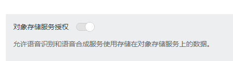

# 定制语音识别<a name="sis_03_0101"></a>

本节通过调用SIS服务的定制语音识别的录音文件识别API使用语音识别功能。

> **说明：**   
>通过IAM服务获取到的Token有效期为24小时，需要使用同一个Token鉴权时，可以先将Token缓存，避免频繁调用。  

## 涉及API<a name="zh-cn_topic_0171541475_zh-cn_topic_0171174235_zh-cn_topic_0111418639_section101152312311"></a>

当您使用Token认证方式完成认证鉴权时，需要获取用户Token并在调用接口时增加“X-Auth-Token”到业务接口请求消息头中。

-   IAM获取token的API
-   SIS创建集群的API

## 操作步骤<a name="zh-cn_topic_0171541475_zh-cn_topic_0171174235_zh-cn_topic_0111418639_section84735913247"></a>

1.  对象存储服务OBS授权。
    1.  在华为云页面顶部选择“EI企业智能 \> 语音交互服务 \> 定制语音识别“，进入产品页。
    2.  单击“立即使用“，输入您注册的“用户名“、“密码“，进入语音交互服务控制台。
    3.  单击“服务授权“，进入服务授权页面。
    4.  设置“对象存储服务授权“为打开状态，完成授权操作。

        

2.  发送“POST https://**IAM**_**的Endpoint**_/v3/auth/tokens”。

    Token认证操作请参考[认证鉴权](认证鉴权.md)。

3.  在Request Header中增加“X-Auth-Token”。
4.  请求消息示例如下：

    ```
    POST https://{endpoint}/v1/1609d8170cd86660a81281e5a3a03f8b/asr/transcriber/jobs
    Content-Type: application/json
    X-Auth-Token: MIINRwYJKoZIhvcNAQcCoIINODCCDTQCAQExDTALBglghkgBZQMEAgEwgguVBgkqhkiG...
    
    {
    "config":
    {
    "audio_format": "auto",
    "property": "chinese_8k_common",
    "add_punc": "yes",
    "need_analysis_info":
    {
    "diarization": true,
    "channel": "LEFT_AGENT",
    "emotion": true
    }
    },
    "data_url":"https://****_voip.obs.cn-north-4.myhuaweicloud.com/VOIP/***.wav"
    }
    ```

5.  <a name="zh-cn_topic_0092677182_le195d2ff096f45e1b5cf926ccef95f80"></a>成功响应示例如下：

    ```
    {
    "job_id": "567e6536-a89c-13c3-a882-826321939656"
    }
    ```

6.  请求响应成功后，返回200 ，表示成功。

    若请求失败，则会返回错误码及对应的错误信息说明，详细错误码信息请参考[状态码](状态码.md)。

7.  根据[5](#zh-cn_topic_0092677182_le195d2ff096f45e1b5cf926ccef95f80)中返回的job\_id，对转写结果进行查询，请求消息示例如下：

    ```
    GET https://{endpoint}/v1/1609d8170cd86660a81281e5a3a03f8b/asr/transcriber/jobs/567e6536-a89c-13c3-a882-826321939656
    X-Auth-Token: MIINRwYJKoZIhvcNAQcCoIINODCCDTQCAQExDTALBglghkgBZQMEAgEwgguVBgkqhkiG...
    ```

8.  成功响应示例如下：

    该状态表示录音文件转写未完成，如果转写完成，则直接返回结果。

    具体响应见[录音文件识别状态查询](录音文件识别状态查询.md)。

    ```
    {
    "status": "WAITING",
    "create_time": "2018-12-04T13:10:29.310Z"
    }
    ```

9.  请求响应成功后，返回200，表示成功。

    若请求失败，则会返回错误码及对应的错误信息说明，详细错误码信息请参考[状态码](状态码.md)。


