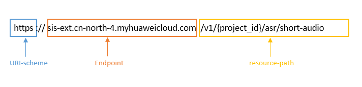

# 构造请求<a name="sis_03_0057"></a>

本节介绍REST API请求的组成，并以调用一句话识别接口说明如何调用API。

您还可以通过这个视频教程了解如何构造请求调用API：[https://bbs.huaweicloud.com/videos/102987](https://bbs.huaweicloud.com/videos/102987)  。

## 请求URI<a name="zh-cn_topic_0171541472_zh-cn_topic_0171174229_zh-cn_topic_0170917207_zh-cn_topic_0168405763_section1849899574"></a>

请求URI由如下部分组成。

**\{URI-scheme\} :// \{**Endpoint**\} / \{resource-path\} ? \{query-string\}**

**表 1**  请求URI

<a name="zh-cn_topic_0171541472_zh-cn_topic_0171174229_zh-cn_topic_0170917207_zh-cn_topic_0168405763_table442645372610"></a>
<table><thead align="left"><tr id="zh-cn_topic_0171541472_zh-cn_topic_0171174229_zh-cn_topic_0170917207_zh-cn_topic_0168405763_row15427253182617"><th class="cellrowborder" valign="top" width="18.790000000000003%" id="mcps1.2.3.1.1"><p id="zh-cn_topic_0171541472_zh-cn_topic_0171174229_zh-cn_topic_0170917207_zh-cn_topic_0168405763_p24271253182614"><a name="zh-cn_topic_0171541472_zh-cn_topic_0171174229_zh-cn_topic_0170917207_zh-cn_topic_0168405763_p24271253182614"></a><a name="zh-cn_topic_0171541472_zh-cn_topic_0171174229_zh-cn_topic_0170917207_zh-cn_topic_0168405763_p24271253182614"></a>参数</p>
</th>
<th class="cellrowborder" valign="top" width="81.21000000000001%" id="mcps1.2.3.1.2"><p id="zh-cn_topic_0171541472_zh-cn_topic_0171174229_zh-cn_topic_0170917207_zh-cn_topic_0168405763_p19427155318264"><a name="zh-cn_topic_0171541472_zh-cn_topic_0171174229_zh-cn_topic_0170917207_zh-cn_topic_0168405763_p19427155318264"></a><a name="zh-cn_topic_0171541472_zh-cn_topic_0171174229_zh-cn_topic_0170917207_zh-cn_topic_0168405763_p19427155318264"></a>说明</p>
</th>
</tr>
</thead>
<tbody><tr id="zh-cn_topic_0171541472_zh-cn_topic_0171174229_zh-cn_topic_0170917207_zh-cn_topic_0168405763_row104278530268"><td class="cellrowborder" valign="top" width="18.790000000000003%" headers="mcps1.2.3.1.1 "><p id="zh-cn_topic_0171541472_zh-cn_topic_0171174229_zh-cn_topic_0170917207_zh-cn_topic_0168405763_p44271053122619"><a name="zh-cn_topic_0171541472_zh-cn_topic_0171174229_zh-cn_topic_0170917207_zh-cn_topic_0168405763_p44271053122619"></a><a name="zh-cn_topic_0171541472_zh-cn_topic_0171174229_zh-cn_topic_0170917207_zh-cn_topic_0168405763_p44271053122619"></a>URI-scheme</p>
</td>
<td class="cellrowborder" valign="top" width="81.21000000000001%" headers="mcps1.2.3.1.2 "><p id="zh-cn_topic_0171541472_zh-cn_topic_0171174229_zh-cn_topic_0170917207_zh-cn_topic_0168405763_p11427453192617"><a name="zh-cn_topic_0171541472_zh-cn_topic_0171174229_zh-cn_topic_0170917207_zh-cn_topic_0168405763_p11427453192617"></a><a name="zh-cn_topic_0171541472_zh-cn_topic_0171174229_zh-cn_topic_0170917207_zh-cn_topic_0168405763_p11427453192617"></a>传输请求的协议，当前所有API均采用<strong id="zh-cn_topic_0171541472_zh-cn_topic_0171174229_zh-cn_topic_0170917207_zh-cn_topic_0168405763_b1626664512275"><a name="zh-cn_topic_0171541472_zh-cn_topic_0171174229_zh-cn_topic_0170917207_zh-cn_topic_0168405763_b1626664512275"></a><a name="zh-cn_topic_0171541472_zh-cn_topic_0171174229_zh-cn_topic_0170917207_zh-cn_topic_0168405763_b1626664512275"></a>HTTPS</strong>协议。</p>
</td>
</tr>
<tr id="zh-cn_topic_0171541472_zh-cn_topic_0171174229_zh-cn_topic_0170917207_zh-cn_topic_0168405763_row1142745318267"><td class="cellrowborder" valign="top" width="18.790000000000003%" headers="mcps1.2.3.1.1 "><p id="zh-cn_topic_0171541472_zh-cn_topic_0171174229_zh-cn_topic_0170917207_zh-cn_topic_0168405763_p1342765311266"><a name="zh-cn_topic_0171541472_zh-cn_topic_0171174229_zh-cn_topic_0170917207_zh-cn_topic_0168405763_p1342765311266"></a><a name="zh-cn_topic_0171541472_zh-cn_topic_0171174229_zh-cn_topic_0170917207_zh-cn_topic_0168405763_p1342765311266"></a>Endpoint</p>
</td>
<td class="cellrowborder" valign="top" width="81.21000000000001%" headers="mcps1.2.3.1.2 "><p id="zh-cn_topic_0171541472_zh-cn_topic_0171174229_zh-cn_topic_0170917207_zh-cn_topic_0168405763_p64278534269"><a name="zh-cn_topic_0171541472_zh-cn_topic_0171174229_zh-cn_topic_0170917207_zh-cn_topic_0168405763_p64278534269"></a><a name="zh-cn_topic_0171541472_zh-cn_topic_0171174229_zh-cn_topic_0170917207_zh-cn_topic_0168405763_p64278534269"></a>承载REST服务端点的服务器域名或IP，不同服务在不同区域，Endpoint不同，可以从<a href="终端节点.md">终端节点</a>中获取。例如，一句话识别服务在<span class="parmname" id="zh-cn_topic_0171541472_zh-cn_topic_0171174229_zh-cn_topic_0170917207_zh-cn_topic_0168405763_parmname161691327202815"><a name="zh-cn_topic_0171541472_zh-cn_topic_0171174229_zh-cn_topic_0170917207_zh-cn_topic_0168405763_parmname161691327202815"></a><a name="zh-cn_topic_0171541472_zh-cn_topic_0171174229_zh-cn_topic_0170917207_zh-cn_topic_0168405763_parmname161691327202815"></a>“华北-北京四”</span>区域的Endpoint为<span class="parmname" id="zh-cn_topic_0171541472_zh-cn_topic_0171174229_zh-cn_topic_0170917207_zh-cn_topic_0168405763_parmname6169162762813"><a name="zh-cn_topic_0171541472_zh-cn_topic_0171174229_zh-cn_topic_0170917207_zh-cn_topic_0168405763_parmname6169162762813"></a><a name="zh-cn_topic_0171541472_zh-cn_topic_0171174229_zh-cn_topic_0170917207_zh-cn_topic_0168405763_parmname6169162762813"></a>“sis-ext.cn-north-4.myhuaweicloud.com”</span>。</p>
</td>
</tr>
<tr id="zh-cn_topic_0171541472_zh-cn_topic_0171174229_zh-cn_topic_0170917207_zh-cn_topic_0168405763_row94271453112615"><td class="cellrowborder" valign="top" width="18.790000000000003%" headers="mcps1.2.3.1.1 "><p id="zh-cn_topic_0171541472_zh-cn_topic_0171174229_zh-cn_topic_0170917207_zh-cn_topic_0168405763_p144271753182618"><a name="zh-cn_topic_0171541472_zh-cn_topic_0171174229_zh-cn_topic_0170917207_zh-cn_topic_0168405763_p144271753182618"></a><a name="zh-cn_topic_0171541472_zh-cn_topic_0171174229_zh-cn_topic_0170917207_zh-cn_topic_0168405763_p144271753182618"></a>resource-path</p>
</td>
<td class="cellrowborder" valign="top" width="81.21000000000001%" headers="mcps1.2.3.1.2 "><p id="zh-cn_topic_0171541472_zh-cn_topic_0171174229_zh-cn_topic_0170917207_zh-cn_topic_0168405763_p4427953122617"><a name="zh-cn_topic_0171541472_zh-cn_topic_0171174229_zh-cn_topic_0170917207_zh-cn_topic_0168405763_p4427953122617"></a><a name="zh-cn_topic_0171541472_zh-cn_topic_0171174229_zh-cn_topic_0170917207_zh-cn_topic_0168405763_p4427953122617"></a>资源路径，即API访问路径。从具体API的URI模块获取，例如<span class="parmname" id="zh-cn_topic_0171541472_zh-cn_topic_0171174229_zh-cn_topic_0170917207_zh-cn_topic_0168405763_parmname663013436287"><a name="zh-cn_topic_0171541472_zh-cn_topic_0171174229_zh-cn_topic_0170917207_zh-cn_topic_0168405763_parmname663013436287"></a><a name="zh-cn_topic_0171541472_zh-cn_topic_0171174229_zh-cn_topic_0170917207_zh-cn_topic_0168405763_parmname663013436287"></a>“一句话识别”</span>API的resource-path为的<span class="parmvalue" id="zh-cn_topic_0171541472_zh-cn_topic_0171174229_zh-cn_topic_0170917207_zh-cn_topic_0168405763_parmvalue176306433280"><a name="zh-cn_topic_0171541472_zh-cn_topic_0171174229_zh-cn_topic_0170917207_zh-cn_topic_0168405763_parmvalue176306433280"></a><a name="zh-cn_topic_0171541472_zh-cn_topic_0171174229_zh-cn_topic_0170917207_zh-cn_topic_0168405763_parmvalue176306433280"></a>“/v1/{project_id}/asr/short-audio”</span>。其中<span class="parmname" id="parmname718411091412"><a name="parmname718411091412"></a><a name="parmname718411091412"></a>“project_id”</span>需要替换成用户的项目ID，可参考<a href="获取项目ID.md">获取项目ID</a>。</p>
</td>
</tr>
<tr id="zh-cn_topic_0171541472_zh-cn_topic_0171174229_zh-cn_topic_0170917207_zh-cn_topic_0168405763_row1991179192817"><td class="cellrowborder" valign="top" width="18.790000000000003%" headers="mcps1.2.3.1.1 "><p id="zh-cn_topic_0171541472_zh-cn_topic_0171174229_zh-cn_topic_0170917207_zh-cn_topic_0168405763_p1091217918289"><a name="zh-cn_topic_0171541472_zh-cn_topic_0171174229_zh-cn_topic_0170917207_zh-cn_topic_0168405763_p1091217918289"></a><a name="zh-cn_topic_0171541472_zh-cn_topic_0171174229_zh-cn_topic_0170917207_zh-cn_topic_0168405763_p1091217918289"></a>query-string</p>
</td>
<td class="cellrowborder" valign="top" width="81.21000000000001%" headers="mcps1.2.3.1.2 "><p id="zh-cn_topic_0171541472_zh-cn_topic_0171174229_zh-cn_topic_0170917207_zh-cn_topic_0168405763_p79121799283"><a name="zh-cn_topic_0171541472_zh-cn_topic_0171174229_zh-cn_topic_0170917207_zh-cn_topic_0168405763_p79121799283"></a><a name="zh-cn_topic_0171541472_zh-cn_topic_0171174229_zh-cn_topic_0170917207_zh-cn_topic_0168405763_p79121799283"></a>查询参数，可选，查询参数前面需要带一个<span class="parmname" id="zh-cn_topic_0171541472_zh-cn_topic_0171174229_zh-cn_topic_0170917207_zh-cn_topic_0168405763_parmname5182450132811"><a name="zh-cn_topic_0171541472_zh-cn_topic_0171174229_zh-cn_topic_0170917207_zh-cn_topic_0168405763_parmname5182450132811"></a><a name="zh-cn_topic_0171541472_zh-cn_topic_0171174229_zh-cn_topic_0170917207_zh-cn_topic_0168405763_parmname5182450132811"></a>“？”</span>，形式为<span class="parmname" id="zh-cn_topic_0171541472_zh-cn_topic_0171174229_zh-cn_topic_0170917207_zh-cn_topic_0168405763_parmname1718315019284"><a name="zh-cn_topic_0171541472_zh-cn_topic_0171174229_zh-cn_topic_0170917207_zh-cn_topic_0168405763_parmname1718315019284"></a><a name="zh-cn_topic_0171541472_zh-cn_topic_0171174229_zh-cn_topic_0170917207_zh-cn_topic_0168405763_parmname1718315019284"></a>“参数名=参数取值”</span>。例如<span class="parmname" id="parmname493945019172"><a name="parmname493945019172"></a><a name="parmname493945019172"></a>“录音文件识别状态查询”</span> 中<span class="parmname" id="parmname456741410173"><a name="parmname456741410173"></a><a name="parmname456741410173"></a>“job_id=123”</span>表示查询<span class="parmname" id="parmname32511818131015"><a name="parmname32511818131015"></a><a name="parmname32511818131015"></a>“job_id”</span>为123的任务结果。</p>
</td>
</tr>
</tbody>
</table>

例如，在“华北-北京四”“区域调用[一句话识别](一句话识别.md)API，则需要使用“华北-北京四“区域的Endpoint（sis-ext.cn-north-4.myhuaweicloud.com），拼接起来如下所示。

```
https://sis-ext.cn-north-4.myhuaweicloud.com/v1/{project_id}/asr/short-audio
```

**图 1**  URI示意图<a name="fig19585211346"></a>  


> **说明：** 
>为查看方便，每个具体API的URI，只给出resource-path部分，并将请求方法写在一起。这是因为URI-scheme都是HTTPS，而Endpoint在同一个区域也相同，所以简洁起见将这两部分省略。

## 请求方法<a name="zh-cn_topic_0171541472_zh-cn_topic_0171174229_zh-cn_topic_0170917207_zh-cn_topic_0168405763_section580035055419"></a>

HTTP请求方法（也称为操作或动词），它告诉服务你正在请求什么类型的操作。

-   **GET**：请求服务器返回指定资源。
-   **PUT**：请求服务器更新指定资源。
-   **POST**：请求服务器新增资源或执行特殊操作。
-   **DELETE**：请求服务器删除指定资源，如删除对象等。
-   **HEAD**：请求服务器资源头部。
-   **PATCH**：请求服务器更新资源的部分内容。当资源不存在的时候，PATCH可能会去创建一个新的资源。

在[一句话识别](一句话识别.md)的URI部分，您可以看到其请求方法为“POST“，则其请求为：

```
POST https://sis-ext.cn-north-4.myhuaweicloud.com/v1/{project_id}/asr/short-audio
```

## 请求消息头<a name="zh-cn_topic_0171541472_zh-cn_topic_0171174229_zh-cn_topic_0170917207_zh-cn_topic_0168405763_section1454211155819"></a>

附加请求头字段，如指定的URI和HTTP方法所要求的字段。例如定义消息体类型的请求头“Content-Type“，请求鉴权信息等。

如下公共消息头需要添加到请求中。

-   **Content-Type**：消息体的类型（格式），必选，默认取值为“application/json“。
-   **X-Auth-Token**：用户Token，可选，当使用Token方式认证时，必须填充该字段。用户Token请参考[认证鉴权](认证鉴权.md)中的“Token认证“。

添加消息头后的请求如下所示：

```
POST https://sis-ext.cn-north-4.myhuaweicloud.com/v1/{project_id}/asr/short-audio
Content-Type: application/json
X-Auth-Token: MIINRwYJKoZIhvcNAQcCoIINOD... 
```

## 请求消息体<a name="zh-cn_topic_0171541472_zh-cn_topic_0171174229_zh-cn_topic_0170917207_zh-cn_topic_0168405763_section14612192315587"></a>

请求消息体通常以结构化格式发出，与请求消息头中Content-type对应，传递除请求消息头之外的内容。若请求消息体中参数支持中文，则中文字符必须为UTF-8编码。

每个接口的请求消息体内容不同，也并不是每个接口都需要有请求消息体（或者说消息体为空），GET、DELETE操作类型的接口就不需要消息体，消息体具体内容需要根据具体接口而定。

对于[一句话识别](一句话识别.md)接口，您可以从接口的请求部分看到所需的请求参数及参数说明。将消息体加入后的请求如下所示，其中“data“参数表示将音频转化为Base64编码字符串。

```
POST  https://sis-ext.cn-north-4.myhuaweicloud.com/v1/{project_id}/asr/short-audio
Content-Type: application/json
X-Auth-Token: MIINRwYJKoZIhvcNAQcCoIINOD... 

{
    “data”: “encode audio by Base64”,
    “config”: {
        “audio_format”: “wav”,
        “property”: “chinese_8k_common”
        
    }
}

```

到这里为止这个请求需要的内容就具备齐全了，您可以使用[curl](https://curl.haxx.se/)、[Postman](https://www.getpostman.com/)或直接编写代码等方式发送请求调用API。对于[一句话识别](一句话识别.md)接口，您可以从响应消息部分看到返回参数及参数说明。

