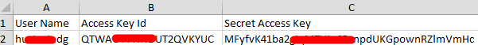
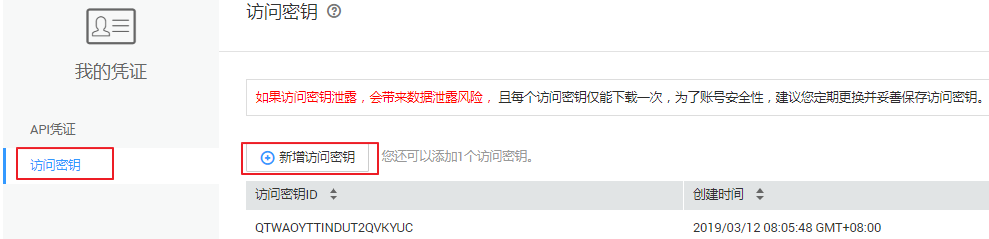

# 获取AK/SK

如果已生成过AK/SK，则可跳过此步骤，找到原来已下载的AK/SK文件，文件名一般为：credentials.csv。

如下图所示，文件包含了租户名（User Name），AK（Access Key Id），SK（Secret Access Key）。

**图 1**  credential.csv文件内容  

AK/SK生成步骤：

1.  登录管理控制台。
2.  单击右上角的用户名，在下拉列表中单击“我的凭证”。

1.  单击“访问密钥”。
2.  单击“新增访问密钥”，进入“新增访问密钥”页面。
3.  依据界面提示，获取并下载秘钥，请妥善保管。

**图 2**  获取访问秘钥  

