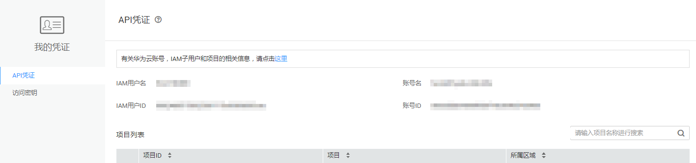

# 获取帐号ID

在调用接口的时候，部分URL中需要填入帐号ID（domain-id），所以需要先在管理控制台上获取到帐号ID。帐号ID获取步骤如下：

1.  注册并登录管理控制台。
2.  在控制台中，鼠标移动至右上角的用户名处，在下拉列表中选择“我的凭证“。

    **图 1**  我的凭证入口  
    

3.  在“我的凭证”页面的项目列表中查看帐号ID。

    **图 2**  查看帐号ID  
    

