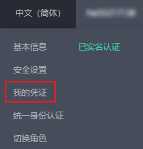
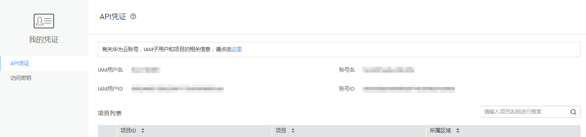

# 获取项目ID<a name="sis_03_0008"></a>

## 从控制台获取项目ID<a name="section19885123154616"></a>

1.  登录[管理控制台](https://console.huaweicloud.com/console/?locale=zh-cn)。
2.  在控制台中，鼠标移动至右上角的用户名处，在下拉列表中选择“我的凭证“。

    **图 1**  我的凭证入口<a name="fig361452524618"></a>  
    

3.  在“我的凭证“页面，可以查看用户名、帐号名，在项目列表中查看项目。

    **图 2**  查看项目ID<a name="fig20626132135515"></a>  
    


多项目时，展开“所属区域”，从“项目ID”列获取子项目ID。

## 调用API获取项目ID<a name="section152741133194610"></a>

获取项目ID的接口为“GET https://\{Endpoint\}/v3/projects”，其中\{Endpoint\}为IAM的终端节点。接口的认证鉴权请参见[认证鉴权](认证鉴权.md)。

响应示例如下，例如，语音交互服务部署的区域为“cn-north-4“，响应消息体中查找“name“为“cn-north-4“，其中projects下的“id”即为项目ID。

```
{ 
    "projects": [ 
        { 
            "domain_id": "65382450e8f64ac0870cd180d14e684b", 
            "is_domain": false, 
            "parent_id": "65382450e8f64ac0870cd180d14e684b", 
            "name": "project_name", 
            "description": "", 
            "links": { 
                "next": null, 
                "previous": null, 
                "self": "https://support-intl.huaweicloud.com/zh-cn/devg-apisign/api-sign-provide.htmlcd05f897d6b99" 
            }, 
            "id": "a4a5d4098fb4474fa22cd05f897d6b99", 
            "enabled": true 
        } 
    ], 
    "links": { 
        "next": null, 
        "previous": null, 
        "self": "https://www.example.com/v3/projects" 
    } 
}
```

