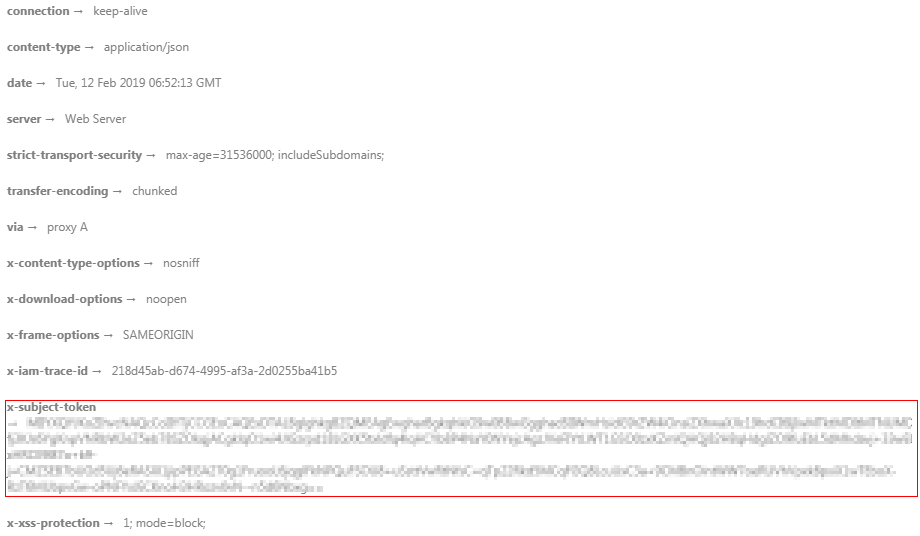

# 认证鉴权<a name="sis_03_0058"></a>

调用接口有如下两种认证方式，您可以选择其中一种进行认证鉴权。

-   Token认证：通过Token认证通用请求。
-   AK/SK认证：通过AK（Access Key ID）/SK（Secret Access Key\)加密调用请求。

## Token认证<a name="zh-cn_topic_0171541473_zh-cn_topic_0171174230_zh-cn_topic_0170917208_section34951335121613"></a>

> **说明：** 
>Token的有效期为24小时，需要使用同一个Token鉴权时，可以缓存起来，避免频繁调用。

Token在计算机系统中代表令牌（临时）的意思，拥有Token就代表拥有某种权限。Token认证就是在调用API的时候将Token加到请求消息头，从而通过身份认证，获得操作API的权限。

获取用户Token接口请求构造如下，您可以从接口的请求部分看到所需的请求参数及参数说明。获取Token消息头只需填写“Content-Type”，将消息体加入后的请求如下所示。

加粗的斜体字段需要根据实际值填写，其中**_username_**为用户名，_**domainname**_为用户所属的帐号名称，**_\*\*\*\*\*\*\*\*_**为用户登录密码。username，domainname和project name的获取方法参见[获取用户名、用户ID、项目名称、项目ID](https://support.huaweicloud.com/api-iam/iam_17_0002.html)。

获取Token的终端节点和**_projectname_**需与SIS服务终端节点保持一致。当访问华北-北京四的终端节点（即sis-ext.**_cn-north-4_**.myhuaweicloud.com）时，获取Token请使用终端节点https://iam.**_cn-north-4_**.myhuaweicloud.com，**_projectname_**对应使用_**cn-north-4**_。

Token可通过调用[获取用户Token](https://support.huaweicloud.com/api-iam/iam_30_0001.html)接口获取，调用本服务API需要project级别的Token，即调用[获取用户Token](https://support.huaweicloud.com/api-iam/iam_30_0001.html)接口时，请求body中auth.scope的取值需要选择project，如下所示。

```
POST https://iam.cn-north-4.myhuaweicloud.com/v3/auth/tokens
Content-Type: application/json 
 
{ 
    "auth": { 
        "identity": { 
            "methods": [ 
                "password" 
            ], 
            "password": { 
                "user": { 
                    "name": "username", 
                    "password": "********", 
                    "domain": { 
                        "name": "domainname" 
                    } 
                } 
            } 
        }, 
        "scope": { 
            "project": { 
                "name": "projectname" 
            } 
        } 
    } 
}
```

如下图所示，返回的响应消息头中“x-subject-token”就是需要获取的用户Token。获取Token之后，您就可以使用Token认证调用SIS服务API。

**图 1**  获取用户Token响应消息头<a name="fig136251420404"></a>  


获取Token后，再调用其他接口时，您需要在请求消息头中添加“X-Auth-Token”，其值即为Token。例如Token值为“ABCDEFJ....”，则调用接口时将“X-Auth-Token: ABCDEFJ....”加到请求消息头即可，如下所示。

```
Content-Type: application/json
X-Auth-Token: ABCDEFJ....
```

您还可以通过这个视频教程了解如何使用Token认证：[https://bbs.huaweicloud.com/videos/101333](https://bbs.huaweicloud.com/videos/101333)  。

## AK/SK认证<a name="zh-cn_topic_0171541473_zh-cn_topic_0171174230_zh-cn_topic_0170917208_section5605322191914"></a>

> **说明：** 
>AK/SK签名认证方式仅支持消息体在12M以内，12M以上的请求请使用Token认证。

AK/SK认证就是使用AK/SK对请求进行签名，在请求时将签名信息添加到消息头，从而通过身份认证。

-   AK\(Access Key ID\)：访问密钥ID。与私有访问密钥关联的唯一标识符；访问密钥ID和私有访问密钥一起使用，对请求进行加密签名。
-   SK\(Secret Access Key\)：与访问密钥ID结合使用的密钥，对请求进行加密签名，可标识发送方，并防止请求被修改。

使用AK/SK认证时，您可以基于签名算法使用AK/SK对请求进行签名，也可以使用专门的签名SDK对请求进行签名。详细的签名方法和SDK使用方法请参见[API签名指南](https://support.huaweicloud.com/devg-apisign/api-sign-provide.html)。

> **须知：** 
>签名SDK只提供签名功能，与服务提供的SDK不同，使用时请注意。
>AK/SK获取方式请参考[获取AK/SK](获取AK-SK.md)。

