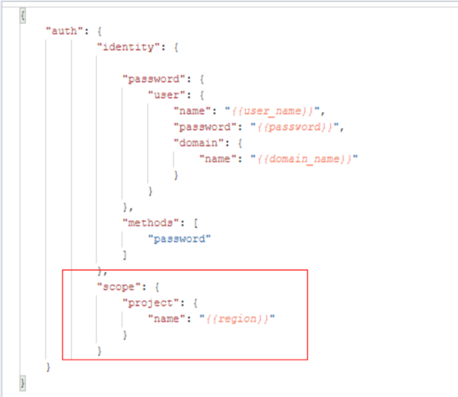

# 错误码<a name="sis_03_0045"></a>

调用接口出错后，将不会返回结果数据。调用方可根据每个接口对应的错误码来定位错误原因。当调用出错时，HTTPS请求返回一个 4xx 或 5xx 的 HTTPS状态码。返回的消息体中是具体的错误代码及错误信息。在调用方找不到错误原因时，可以联系华为云客服，并提供错误码，以便尽快帮您解决问题。

## 错误响应Body体格式说明<a name="section144261176131"></a>

当接口调用出错时，会返回错误码及错误信息说明，错误响应的Body体格式如下所示。

```
{ 

    "error_code": "SIS.0032",
    "error_msg": "'audio_format' is invalid"
}
```

其中，error\_code表示错误码，error\_msg表示错误描述信息。

## 错误码说明<a name="section551592811138"></a>

当您调用API时，如果遇到“APIGW”开头的错误码，请参见[API网关错误码](https://support.huaweicloud.com/devg-apisign/api-sign-errorcode.html)进行处理。

<a name="table7639129182519"></a>
<table><thead align="left"><tr id="row88917523254"><th class="cellrowborder" valign="top" width="20.5%" id="mcps1.1.4.1.1"><p id="p1470018414263"><a name="p1470018414263"></a><a name="p1470018414263"></a>返回错误码</p>
</th>
<th class="cellrowborder" valign="top" width="35.69%" id="mcps1.1.4.1.2"><p id="p970094122611"><a name="p970094122611"></a><a name="p970094122611"></a>描述</p>
</th>
<th class="cellrowborder" valign="top" width="43.81%" id="mcps1.1.4.1.3"><p id="p12700645261"><a name="p12700645261"></a><a name="p12700645261"></a>处理措施</p>
</th>
</tr>
</thead>
<tbody><tr id="row16639112922519"><td class="cellrowborder" valign="top" width="20.5%" headers="mcps1.1.4.1.1 "><p id="p2063962920257"><a name="p2063962920257"></a><a name="p2063962920257"></a>SIS.0001</p>
</td>
<td class="cellrowborder" valign="top" width="35.69%" headers="mcps1.1.4.1.2 "><p id="p0639102992511"><a name="p0639102992511"></a><a name="p0639102992511"></a>连接错误，如连接obs错误或者连接redis错误。</p>
</td>
<td class="cellrowborder" valign="top" width="43.81%" headers="mcps1.1.4.1.3 "><p id="p19639429122519"><a name="p19639429122519"></a><a name="p19639429122519"></a>请联系<span>专业工程师</span>。</p>
</td>
</tr>
<tr id="row263962920253"><td class="cellrowborder" valign="top" width="20.5%" headers="mcps1.1.4.1.1 "><p id="p16391229112519"><a name="p16391229112519"></a><a name="p16391229112519"></a>SIS.0003</p>
</td>
<td class="cellrowborder" valign="top" width="35.69%" headers="mcps1.1.4.1.2 "><p id="p06391229152519"><a name="p06391229152519"></a><a name="p06391229152519"></a>token缺少用户信息或者委托已创建或者内部错误。</p>
</td>
<td class="cellrowborder" valign="top" width="43.81%" headers="mcps1.1.4.1.3 "><p id="p146391529192513"><a name="p146391529192513"></a><a name="p146391529192513"></a>请<span>联系专业工程师</span>。</p>
</td>
</tr>
<tr id="row166391129172519"><td class="cellrowborder" valign="top" width="20.5%" headers="mcps1.1.4.1.1 "><p id="p9639329162515"><a name="p9639329162515"></a><a name="p9639329162515"></a>SIS.0100</p>
</td>
<td class="cellrowborder" valign="top" width="35.69%" headers="mcps1.1.4.1.2 "><p id="p56391229112520"><a name="p56391229112520"></a><a name="p56391229112520"></a>服务内部错误。</p>
</td>
<td class="cellrowborder" valign="top" width="43.81%" headers="mcps1.1.4.1.3 "><p id="p142614016467"><a name="p142614016467"></a><a name="p142614016467"></a>请联系<span>专业工程师</span>。</p>
</td>
</tr>
<tr id="row17639172913256"><td class="cellrowborder" valign="top" width="20.5%" headers="mcps1.1.4.1.1 "><p id="p1363916297259"><a name="p1363916297259"></a><a name="p1363916297259"></a>SIS.0101</p>
</td>
<td class="cellrowborder" valign="top" width="35.69%" headers="mcps1.1.4.1.2 "><p id="p16639172932519"><a name="p16639172932519"></a><a name="p16639172932519"></a>验证Token异常。</p>
</td>
<td class="cellrowborder" valign="top" width="43.81%" headers="mcps1.1.4.1.3 "><a name="ul44941357204610"></a><a name="ul44941357204610"></a><ul id="ul44941357204610"><li>请检查请求消息头中的X-Auth-Token是否正确填写，是否缺少字符。</li><li>token请求参数是否正确填写。</li><li>projectId在url是否准确填写。</li><li>帐号是否被冻结。</li><li>获取token时，请求中需添加scope参数，获取项目级别token，调用sis时请勿使用全局token。<p id="p9351625194710"><a name="p9351625194710"></a><a name="p9351625194710"></a><a name="image43511250474"></a><a name="image43511250474"></a><span></span></p>
</li></ul>
</td>
</tr>
<tr id="row13639162912251"><td class="cellrowborder" valign="top" width="20.5%" headers="mcps1.1.4.1.1 "><p id="p4639142913257"><a name="p4639142913257"></a><a name="p4639142913257"></a>SIS.0102</p>
</td>
<td class="cellrowborder" valign="top" width="35.69%" headers="mcps1.1.4.1.2 "><p id="p11639729122516"><a name="p11639729122516"></a><a name="p11639729122516"></a>鉴权信息缺失。</p>
</td>
<td class="cellrowborder" valign="top" width="43.81%" headers="mcps1.1.4.1.3 "><p id="p16391291255"><a name="p16391291255"></a><a name="p16391291255"></a>请检查请求消息头中的X-Auth-Token是否存在。</p>
</td>
</tr>
<tr id="row41321214519"><td class="cellrowborder" valign="top" width="20.5%" headers="mcps1.1.4.1.1 "><p id="p1213191214518"><a name="p1213191214518"></a><a name="p1213191214518"></a>SIS.0103</p>
</td>
<td class="cellrowborder" valign="top" width="35.69%" headers="mcps1.1.4.1.2 "><p id="p414312105112"><a name="p414312105112"></a><a name="p414312105112"></a>实名认证缺失。</p>
</td>
<td class="cellrowborder" valign="top" width="43.81%" headers="mcps1.1.4.1.3 "><p id="p1614151245116"><a name="p1614151245116"></a><a name="p1614151245116"></a>请进行实名认证，认证方法请参见<a href="https://support.huaweicloud.com/usermanual-account/account_auth_00001.html" target="_blank" rel="noopener noreferrer">实名认证介绍</a>。</p>
</td>
</tr>
<tr id="row3639132912258"><td class="cellrowborder" valign="top" width="20.5%" headers="mcps1.1.4.1.1 "><p id="p76391729202512"><a name="p76391729202512"></a><a name="p76391729202512"></a>SIS.0012</p>
</td>
<td class="cellrowborder" valign="top" width="35.69%" headers="mcps1.1.4.1.2 "><p id="p0639929112511"><a name="p0639929112511"></a><a name="p0639929112511"></a>请求体中字段缺失。</p>
</td>
<td class="cellrowborder" valign="top" width="43.81%" headers="mcps1.1.4.1.3 "><p id="p206397296259"><a name="p206397296259"></a><a name="p206397296259"></a>请检查请求参数是否缺失必须字段。</p>
</td>
</tr>
<tr id="row186396299251"><td class="cellrowborder" valign="top" width="20.5%" headers="mcps1.1.4.1.1 "><p id="p16399297251"><a name="p16399297251"></a><a name="p16399297251"></a>SIS.0031</p>
</td>
<td class="cellrowborder" valign="top" width="35.69%" headers="mcps1.1.4.1.2 "><p id="p3639102920256"><a name="p3639102920256"></a><a name="p3639102920256"></a>请求参数不支持。</p>
</td>
<td class="cellrowborder" valign="top" width="43.81%" headers="mcps1.1.4.1.3 "><p id="p14639132916252"><a name="p14639132916252"></a><a name="p14639132916252"></a>请检查请求参数是否正确。</p>
</td>
</tr>
<tr id="row96393294250"><td class="cellrowborder" valign="top" width="20.5%" headers="mcps1.1.4.1.1 "><p id="p963912914254"><a name="p963912914254"></a><a name="p963912914254"></a>SIS.0032</p>
</td>
<td class="cellrowborder" valign="top" width="35.69%" headers="mcps1.1.4.1.2 "><p id="p16399290252"><a name="p16399290252"></a><a name="p16399290252"></a>请求体中的json不正确。</p>
</td>
<td class="cellrowborder" valign="top" width="43.81%" headers="mcps1.1.4.1.3 "><p id="p963952942513"><a name="p963952942513"></a><a name="p963952942513"></a>请检查请求体中的json是否正确。</p>
<a name="ul11211026155311"></a><a name="ul11211026155311"></a><ul id="ul11211026155311"><li>确保设置的audio_format格式的值是合法，即一句话识别的api接口支持的格式。一句话识别支持的音频格式详见<a href="http接口.md#zh-cn_topic_0145253487_table10224419">audio_format取值范围</a>。</li><li>确保待识别音频的格式和设置的audio_format参数格式一致。</li><li>使用实时语音识别是请确认是否分片发送音频，并在wss握手后发送start命令。</li><li>报错data url is empty，时请参考<a href="配置OBS访问权限.md">配置OBS访问权限</a>，设置OBS权限，并检查使用的URL是否正确。</li></ul>
</td>
</tr>
<tr id="row1064032942513"><td class="cellrowborder" valign="top" width="20.5%" headers="mcps1.1.4.1.1 "><p id="p1764012922513"><a name="p1764012922513"></a><a name="p1764012922513"></a>SIS.0022</p>
</td>
<td class="cellrowborder" valign="top" width="35.69%" headers="mcps1.1.4.1.2 "><p id="p1464042942511"><a name="p1464042942511"></a><a name="p1464042942511"></a>产品不可购买。</p>
</td>
<td class="cellrowborder" valign="top" width="43.81%" headers="mcps1.1.4.1.3 "><p id="p11640182911259"><a name="p11640182911259"></a><a name="p11640182911259"></a>产品暂时不开放购买，请联系<span>专业工程师</span>。</p>
</td>
</tr>
<tr id="row26401229162519"><td class="cellrowborder" valign="top" width="20.5%" headers="mcps1.1.4.1.1 "><p id="p56401129132514"><a name="p56401129132514"></a><a name="p56401129132514"></a>SIS.0023</p>
</td>
<td class="cellrowborder" valign="top" width="35.69%" headers="mcps1.1.4.1.2 "><p id="p186401298256"><a name="p186401298256"></a><a name="p186401298256"></a>产品购买失败。</p>
</td>
<td class="cellrowborder" valign="top" width="43.81%" headers="mcps1.1.4.1.3 "><p id="p106402029182515"><a name="p106402029182515"></a><a name="p106402029182515"></a>产品购买失败，请联系<span>专业工程师</span>。</p>
</td>
</tr>
<tr id="row964052942514"><td class="cellrowborder" valign="top" width="20.5%" headers="mcps1.1.4.1.1 "><p id="p664014294250"><a name="p664014294250"></a><a name="p664014294250"></a>SIS.0024</p>
</td>
<td class="cellrowborder" valign="top" width="35.69%" headers="mcps1.1.4.1.2 "><p id="p12640192952516"><a name="p12640192952516"></a><a name="p12640192952516"></a>不允许更新限制。</p>
</td>
<td class="cellrowborder" valign="top" width="43.81%" headers="mcps1.1.4.1.3 "><p id="p126404290252"><a name="p126404290252"></a><a name="p126404290252"></a>产品暂时不允许更新限制，请联系<span>专业工程师</span>。</p>
</td>
</tr>
<tr id="row764012919250"><td class="cellrowborder" valign="top" width="20.5%" headers="mcps1.1.4.1.1 "><p id="p8640929172512"><a name="p8640929172512"></a><a name="p8640929172512"></a>SIS.0033</p>
</td>
<td class="cellrowborder" valign="top" width="35.69%" headers="mcps1.1.4.1.2 "><p id="p18640142972519"><a name="p18640142972519"></a><a name="p18640142972519"></a>引擎响应超时。</p>
</td>
<td class="cellrowborder" valign="top" width="43.81%" headers="mcps1.1.4.1.3 "><p id="p13640182902514"><a name="p13640182902514"></a><a name="p13640182902514"></a>请联系<span>专业工程师</span>。</p>
</td>
</tr>
<tr id="row14422757173315"><td class="cellrowborder" valign="top" width="20.5%" headers="mcps1.1.4.1.1 "><p id="p11643192915259"><a name="p11643192915259"></a><a name="p11643192915259"></a>SIS.0201</p>
</td>
<td class="cellrowborder" valign="top" width="35.69%" headers="mcps1.1.4.1.2 "><p id="p064352915253"><a name="p064352915253"></a><a name="p064352915253"></a>热词表未找到。</p>
</td>
<td class="cellrowborder" valign="top" width="43.81%" headers="mcps1.1.4.1.3 "><p id="p5643112912251"><a name="p5643112912251"></a><a name="p5643112912251"></a>请检查请求参数是否异常，或联系<span>专业工程师</span>。</p>
</td>
</tr>
<tr id="row179364273346"><td class="cellrowborder" valign="top" width="20.5%" headers="mcps1.1.4.1.1 "><p id="p564312952515"><a name="p564312952515"></a><a name="p564312952515"></a>SIS.0203</p>
</td>
<td class="cellrowborder" valign="top" width="35.69%" headers="mcps1.1.4.1.2 "><p id="p10643162922519"><a name="p10643162922519"></a><a name="p10643162922519"></a>部分热词太长或非法。</p>
</td>
<td class="cellrowborder" valign="top" width="43.81%" headers="mcps1.1.4.1.3 "><p id="p86431129102511"><a name="p86431129102511"></a><a name="p86431129102511"></a>请根据错误信息，修改不合法的热词。</p>
</td>
</tr>
<tr id="row17545103063419"><td class="cellrowborder" valign="top" width="20.5%" headers="mcps1.1.4.1.1 "><p id="p364362922518"><a name="p364362922518"></a><a name="p364362922518"></a>SIS.0204</p>
</td>
<td class="cellrowborder" valign="top" width="35.69%" headers="mcps1.1.4.1.2 "><p id="p864312942519"><a name="p864312942519"></a><a name="p864312942519"></a>热词表参数名已存在。</p>
</td>
<td class="cellrowborder" valign="top" width="43.81%" headers="mcps1.1.4.1.3 "><p id="p9643132932512"><a name="p9643132932512"></a><a name="p9643132932512"></a>请修改热词表名称。</p>
</td>
</tr>
<tr id="row144810251340"><td class="cellrowborder" valign="top" width="20.5%" headers="mcps1.1.4.1.1 "><p id="p5643102962518"><a name="p5643102962518"></a><a name="p5643102962518"></a>SIS.0205</p>
</td>
<td class="cellrowborder" valign="top" width="35.69%" headers="mcps1.1.4.1.2 "><p id="p464362912511"><a name="p464362912511"></a><a name="p464362912511"></a>语言不支持。</p>
</td>
<td class="cellrowborder" valign="top" width="43.81%" headers="mcps1.1.4.1.3 "><p id="p46431429202515"><a name="p46431429202515"></a><a name="p46431429202515"></a>请修改热词表语言。</p>
</td>
</tr>
<tr id="row1732714130341"><td class="cellrowborder" valign="top" width="20.5%" headers="mcps1.1.4.1.1 "><p id="p5643182912254"><a name="p5643182912254"></a><a name="p5643182912254"></a>SIS.0206</p>
</td>
<td class="cellrowborder" valign="top" width="35.69%" headers="mcps1.1.4.1.2 "><p id="p18643132992510"><a name="p18643132992510"></a><a name="p18643132992510"></a>保存热词失败。</p>
</td>
<td class="cellrowborder" valign="top" width="43.81%" headers="mcps1.1.4.1.3 "><p id="p16643529122516"><a name="p16643529122516"></a><a name="p16643529122516"></a>请联系<span>专业工程师</span>。</p>
</td>
</tr>
<tr id="row5905189183414"><td class="cellrowborder" valign="top" width="20.5%" headers="mcps1.1.4.1.1 "><p id="p1964316297256"><a name="p1964316297256"></a><a name="p1964316297256"></a>SIS.0207</p>
</td>
<td class="cellrowborder" valign="top" width="35.69%" headers="mcps1.1.4.1.2 "><p id="p156435292256"><a name="p156435292256"></a><a name="p156435292256"></a>热词内容损坏。</p>
</td>
<td class="cellrowborder" valign="top" width="43.81%" headers="mcps1.1.4.1.3 "><p id="p56431429192518"><a name="p56431429192518"></a><a name="p56431429192518"></a>请联系<span>专业工程师</span>。</p>
</td>
</tr>
<tr id="row4446146183416"><td class="cellrowborder" valign="top" width="20.5%" headers="mcps1.1.4.1.1 "><p id="p1264318294252"><a name="p1264318294252"></a><a name="p1264318294252"></a>SIS.0208</p>
</td>
<td class="cellrowborder" valign="top" width="35.69%" headers="mcps1.1.4.1.2 "><p id="p1764362915252"><a name="p1764362915252"></a><a name="p1764362915252"></a>热词表数量过多。</p>
</td>
<td class="cellrowborder" valign="top" width="43.81%" headers="mcps1.1.4.1.3 "><p id="p464314297258"><a name="p464314297258"></a><a name="p464314297258"></a>请删除不需要的热词表，如有配置更多热词表的需求请联系客服人员。</p>
</td>
</tr>
<tr id="row4640122911251"><td class="cellrowborder" valign="top" width="20.5%" headers="mcps1.1.4.1.1 "><p id="p3640192913256"><a name="p3640192913256"></a><a name="p3640192913256"></a>SIS.0301</p>
</td>
<td class="cellrowborder" valign="top" width="35.69%" headers="mcps1.1.4.1.2 "><p id="p176405291259"><a name="p176405291259"></a><a name="p176405291259"></a>输入的audio_format参数不匹配模型。</p>
</td>
<td class="cellrowborder" valign="top" width="43.81%" headers="mcps1.1.4.1.3 "><p id="p0640132942514"><a name="p0640132942514"></a><a name="p0640132942514"></a>请检查请求参数是否正确。</p>
</td>
</tr>
<tr id="row645613732819"><td class="cellrowborder" valign="top" width="20.5%" headers="mcps1.1.4.1.1 "><p id="p9640132972512"><a name="p9640132972512"></a><a name="p9640132972512"></a>SIS.0302</p>
</td>
<td class="cellrowborder" valign="top" width="35.69%" headers="mcps1.1.4.1.2 "><p id="p134561937122814"><a name="p134561937122814"></a><a name="p134561937122814"></a>内部服务异常。</p>
</td>
<td class="cellrowborder" valign="top" width="43.81%" headers="mcps1.1.4.1.3 "><p id="p1929425442717"><a name="p1929425442717"></a><a name="p1929425442717"></a>请联系<span>专业工程师</span>。</p>
</td>
</tr>
<tr id="row1490434042813"><td class="cellrowborder" valign="top" width="20.5%" headers="mcps1.1.4.1.1 "><p id="p064014299258"><a name="p064014299258"></a><a name="p064014299258"></a>SIS.0303</p>
</td>
<td class="cellrowborder" valign="top" width="35.69%" headers="mcps1.1.4.1.2 "><p id="p1464012919257"><a name="p1464012919257"></a><a name="p1464012919257"></a>引擎连接失败。</p>
</td>
<td class="cellrowborder" valign="top" width="43.81%" headers="mcps1.1.4.1.3 "><p id="p264012292255"><a name="p264012292255"></a><a name="p264012292255"></a>请重试，或联系<span>专业工程师</span>。</p>
</td>
</tr>
<tr id="row19861174118321"><td class="cellrowborder" valign="top" width="20.5%" headers="mcps1.1.4.1.1 "><p id="p692216428320"><a name="p692216428320"></a><a name="p692216428320"></a>SIS.0304</p>
</td>
<td class="cellrowborder" valign="top" width="35.69%" headers="mcps1.1.4.1.2 "><p id="p16922104215323"><a name="p16922104215323"></a><a name="p16922104215323"></a>音频等待超时。</p>
</td>
<td class="cellrowborder" valign="top" width="43.81%" headers="mcps1.1.4.1.3 "><p id="p316814407488"><a name="p316814407488"></a><a name="p316814407488"></a>客户端长时间没有发送语音，服务端超过20s没有收到语音会产生该报错。</p>
<a name="ul1095918420480"></a><a name="ul1095918420480"></a><ul id="ul1095918420480"><li>请减小数据发送间隔。</li><li>检查代码是否存在发送音频后睡眠过多时间。</li><li>检查是否发送end请求，是否关闭客户端。</li></ul>
</td>
</tr>
<tr id="row146401729162519"><td class="cellrowborder" valign="top" width="20.5%" headers="mcps1.1.4.1.1 "><p id="p764015298258"><a name="p764015298258"></a><a name="p764015298258"></a>SIS.0305</p>
</td>
<td class="cellrowborder" valign="top" width="35.69%" headers="mcps1.1.4.1.2 "><p id="p164082962514"><a name="p164082962514"></a><a name="p164082962514"></a>引擎异常。</p>
</td>
<td class="cellrowborder" valign="top" width="43.81%" headers="mcps1.1.4.1.3 "><p id="p1964052919258"><a name="p1964052919258"></a><a name="p1964052919258"></a>请重试，或联系<span>专业工程师</span>。</p>
</td>
</tr>
<tr id="row13640429182520"><td class="cellrowborder" valign="top" width="20.5%" headers="mcps1.1.4.1.1 "><p id="p18640152911251"><a name="p18640152911251"></a><a name="p18640152911251"></a>SIS.0306</p>
</td>
<td class="cellrowborder" valign="top" width="35.69%" headers="mcps1.1.4.1.2 "><p id="p1564011294256"><a name="p1564011294256"></a><a name="p1564011294256"></a>语音识别异常。</p>
</td>
<td class="cellrowborder" valign="top" width="43.81%" headers="mcps1.1.4.1.3 "><p id="p1264002912518"><a name="p1264002912518"></a><a name="p1264002912518"></a>请重试，或联系<span>专业工程师</span>。</p>
</td>
</tr>
<tr id="row145611658103217"><td class="cellrowborder" valign="top" width="20.5%" headers="mcps1.1.4.1.1 "><p id="p56427297252"><a name="p56427297252"></a><a name="p56427297252"></a>SIS.0307</p>
</td>
<td class="cellrowborder" valign="top" width="35.69%" headers="mcps1.1.4.1.2 "><p id="p16421829132517"><a name="p16421829132517"></a><a name="p16421829132517"></a>任务异常。</p>
</td>
<td class="cellrowborder" valign="top" width="43.81%" headers="mcps1.1.4.1.3 "><p id="p864292932519"><a name="p864292932519"></a><a name="p864292932519"></a>请重试，或联系<span>专业工程师</span>。</p>
</td>
</tr>
<tr id="row1464152972516"><td class="cellrowborder" valign="top" width="20.5%" headers="mcps1.1.4.1.1 "><p id="p6641029112510"><a name="p6641029112510"></a><a name="p6641029112510"></a>SIS.0401</p>
</td>
<td class="cellrowborder" valign="top" width="35.69%" headers="mcps1.1.4.1.2 "><p id="p5641112915252"><a name="p5641112915252"></a><a name="p5641112915252"></a>语音合成异常。</p>
</td>
<td class="cellrowborder" valign="top" width="43.81%" headers="mcps1.1.4.1.3 "><p id="p06411629112512"><a name="p06411629112512"></a><a name="p06411629112512"></a>请重试，或联系<span>专业工程师</span>。</p>
</td>
</tr>
<tr id="row10641529192519"><td class="cellrowborder" valign="top" width="20.5%" headers="mcps1.1.4.1.1 "><p id="p116411329132515"><a name="p116411329132515"></a><a name="p116411329132515"></a>SIS.0402</p>
</td>
<td class="cellrowborder" valign="top" width="35.69%" headers="mcps1.1.4.1.2 "><p id="p186411529112519"><a name="p186411529112519"></a><a name="p186411529112519"></a>语音合成输入的sample_rate参数非法。</p>
</td>
<td class="cellrowborder" valign="top" width="43.81%" headers="mcps1.1.4.1.3 "><p id="p16411329102511"><a name="p16411329102511"></a><a name="p16411329102511"></a>请检查请求参数是否正确。</p>
</td>
</tr>
<tr id="row264120295258"><td class="cellrowborder" valign="top" width="20.5%" headers="mcps1.1.4.1.1 "><p id="p764112918258"><a name="p764112918258"></a><a name="p764112918258"></a>SIS.0410</p>
</td>
<td class="cellrowborder" valign="top" width="35.69%" headers="mcps1.1.4.1.2 "><p id="p12641112919258"><a name="p12641112919258"></a><a name="p12641112919258"></a>语音合成输入的audio_format参数非法。</p>
</td>
<td class="cellrowborder" valign="top" width="43.81%" headers="mcps1.1.4.1.3 "><p id="p1641132992511"><a name="p1641132992511"></a><a name="p1641132992511"></a>请检查请求参数是否正确。</p>
</td>
</tr>
<tr id="row12641112914255"><td class="cellrowborder" valign="top" width="20.5%" headers="mcps1.1.4.1.1 "><p id="p16411929142512"><a name="p16411929142512"></a><a name="p16411929142512"></a>SIS.0411</p>
</td>
<td class="cellrowborder" valign="top" width="35.69%" headers="mcps1.1.4.1.2 "><p id="p1164112299255"><a name="p1164112299255"></a><a name="p1164112299255"></a>语音合成输入的property参数非法。</p>
</td>
<td class="cellrowborder" valign="top" width="43.81%" headers="mcps1.1.4.1.3 "><p id="p5641102912252"><a name="p5641102912252"></a><a name="p5641102912252"></a>请检查请求参数是否正确。</p>
</td>
</tr>
<tr id="row764132917252"><td class="cellrowborder" valign="top" width="20.5%" headers="mcps1.1.4.1.1 "><p id="p9641142932511"><a name="p9641142932511"></a><a name="p9641142932511"></a>SIS.0412</p>
</td>
<td class="cellrowborder" valign="top" width="35.69%" headers="mcps1.1.4.1.2 "><p id="p1464162912518"><a name="p1464162912518"></a><a name="p1464162912518"></a>连接语音合成引擎超时。</p>
</td>
<td class="cellrowborder" valign="top" width="43.81%" headers="mcps1.1.4.1.3 "><p id="p12641192913252"><a name="p12641192913252"></a><a name="p12641192913252"></a>请重试，或联系<span>专业工程师</span>。</p>
</td>
</tr>
<tr id="row1164112919251"><td class="cellrowborder" valign="top" width="20.5%" headers="mcps1.1.4.1.1 "><p id="p36412297252"><a name="p36412297252"></a><a name="p36412297252"></a>SIS.0413</p>
</td>
<td class="cellrowborder" valign="top" width="35.69%" headers="mcps1.1.4.1.2 "><p id="p5641129162512"><a name="p5641129162512"></a><a name="p5641129162512"></a>语音合成内部错误。</p>
</td>
<td class="cellrowborder" valign="top" width="43.81%" headers="mcps1.1.4.1.3 "><p id="p2064211292256"><a name="p2064211292256"></a><a name="p2064211292256"></a>请重试，或联系<span>专业工程师</span>。</p>
</td>
</tr>
<tr id="row1642112902516"><td class="cellrowborder" valign="top" width="20.5%" headers="mcps1.1.4.1.1 "><p id="p564242912518"><a name="p564242912518"></a><a name="p564242912518"></a>SIS.0414</p>
</td>
<td class="cellrowborder" valign="top" width="35.69%" headers="mcps1.1.4.1.2 "><p id="p164252910256"><a name="p164252910256"></a><a name="p164252910256"></a>语音合成等待语音合成超时。</p>
</td>
<td class="cellrowborder" valign="top" width="43.81%" headers="mcps1.1.4.1.3 "><p id="p1664220298251"><a name="p1664220298251"></a><a name="p1664220298251"></a>请重试，或联系<span>专业工程师</span>。</p>
</td>
</tr>
<tr id="row1664222912258"><td class="cellrowborder" valign="top" width="20.5%" headers="mcps1.1.4.1.1 "><p id="p206421629182518"><a name="p206421629182518"></a><a name="p206421629182518"></a>SIS.0415</p>
</td>
<td class="cellrowborder" valign="top" width="35.69%" headers="mcps1.1.4.1.2 "><p id="p17642152920250"><a name="p17642152920250"></a><a name="p17642152920250"></a>语音合成请求体参数错误。</p>
</td>
<td class="cellrowborder" valign="top" width="43.81%" headers="mcps1.1.4.1.3 "><p id="p1464282911251"><a name="p1464282911251"></a><a name="p1464282911251"></a>请检查请求体是否准确。</p>
</td>
</tr>
<tr id="row263372931611"><td class="cellrowborder" valign="top" width="20.5%" headers="mcps1.1.4.1.1 "><p id="p2063312919164"><a name="p2063312919164"></a><a name="p2063312919164"></a>SIS.0416</p>
</td>
<td class="cellrowborder" valign="top" width="35.69%" headers="mcps1.1.4.1.2 "><p id="p063382991619"><a name="p063382991619"></a><a name="p063382991619"></a>等待用户发送合成文本超时。</p>
</td>
<td class="cellrowborder" valign="top" width="43.81%" headers="mcps1.1.4.1.3 "><p id="p7633192911162"><a name="p7633192911162"></a><a name="p7633192911162"></a>请重新发送需要合成的文本内容。</p>
</td>
</tr>
<tr id="row86294159172"><td class="cellrowborder" valign="top" width="20.5%" headers="mcps1.1.4.1.1 "><p id="p6629131561710"><a name="p6629131561710"></a><a name="p6629131561710"></a>SIS.0417</p>
</td>
<td class="cellrowborder" valign="top" width="35.69%" headers="mcps1.1.4.1.2 "><p id="p0629171591717"><a name="p0629171591717"></a><a name="p0629171591717"></a>TTS引擎错误。</p>
</td>
<td class="cellrowborder" valign="top" width="43.81%" headers="mcps1.1.4.1.3 "><p id="p1525510101810"><a name="p1525510101810"></a><a name="p1525510101810"></a>请重试，或联系<span>专业工程师</span>。</p>
</td>
</tr>
<tr id="row32602014141816"><td class="cellrowborder" valign="top" width="20.5%" headers="mcps1.1.4.1.1 "><p id="p72613142180"><a name="p72613142180"></a><a name="p72613142180"></a>SIS.0418</p>
</td>
<td class="cellrowborder" valign="top" width="35.69%" headers="mcps1.1.4.1.2 "><p id="p3261131431812"><a name="p3261131431812"></a><a name="p3261131431812"></a>当前链接已有合成任务。</p>
</td>
<td class="cellrowborder" valign="top" width="43.81%" headers="mcps1.1.4.1.3 "><p id="p16261171471815"><a name="p16261171471815"></a><a name="p16261171471815"></a>请勿重复发送开始合成命令。</p>
</td>
</tr>
<tr id="row149487385202"><td class="cellrowborder" valign="top" width="20.5%" headers="mcps1.1.4.1.1 "><p id="p2948153816203"><a name="p2948153816203"></a><a name="p2948153816203"></a>SIS.0506</p>
</td>
<td class="cellrowborder" valign="top" width="35.69%" headers="mcps1.1.4.1.2 "><p id="p8948153813201"><a name="p8948153813201"></a><a name="p8948153813201"></a>找不到代理错误。</p>
</td>
<td class="cellrowborder" valign="top" width="43.81%" headers="mcps1.1.4.1.3 "><a name="ul22918282210"></a><a name="ul22918282210"></a><ul id="ul22918282210"><li>请检查网络是否有设置代理。</li><li>请在控制台检查OBS是否已授权。<p id="p14527527192214"><a name="p14527527192214"></a><a name="p14527527192214"></a><a name="image552752717224"></a><a name="image552752717224"></a><span></span></p>
</li></ul>
</td>
</tr>
<tr id="row4642132982515"><td class="cellrowborder" valign="top" width="20.5%" headers="mcps1.1.4.1.1 "><p id="p166421329172510"><a name="p166421329172510"></a><a name="p166421329172510"></a>SIS.0533</p>
</td>
<td class="cellrowborder" valign="top" width="35.69%" headers="mcps1.1.4.1.2 "><p id="p2642182912513"><a name="p2642182912513"></a><a name="p2642182912513"></a>录音文件识别请求参数错误。</p>
</td>
<td class="cellrowborder" valign="top" width="43.81%" headers="mcps1.1.4.1.3 "><p id="p9642229112518"><a name="p9642229112518"></a><a name="p9642229112518"></a>请检查请求参数是否正确。</p>
</td>
</tr>
<tr id="row964210292253"><td class="cellrowborder" valign="top" width="20.5%" headers="mcps1.1.4.1.1 "><p id="p1864212915259"><a name="p1864212915259"></a><a name="p1864212915259"></a>SIS.0534</p>
</td>
<td class="cellrowborder" valign="top" width="35.69%" headers="mcps1.1.4.1.2 "><p id="p16642142912258"><a name="p16642142912258"></a><a name="p16642142912258"></a>录音文件识请求体错误。</p>
</td>
<td class="cellrowborder" valign="top" width="43.81%" headers="mcps1.1.4.1.3 "><p id="p1564272912514"><a name="p1564272912514"></a><a name="p1564272912514"></a>请检查请求体是否正确。</p>
</td>
</tr>
<tr id="row1264282942519"><td class="cellrowborder" valign="top" width="20.5%" headers="mcps1.1.4.1.1 "><p id="p1364232932518"><a name="p1364232932518"></a><a name="p1364232932518"></a>SIS.0535</p>
</td>
<td class="cellrowborder" valign="top" width="35.69%" headers="mcps1.1.4.1.2 "><p id="p5642929142514"><a name="p5642929142514"></a><a name="p5642929142514"></a>录音文件识请求的文件类型不支持。</p>
</td>
<td class="cellrowborder" valign="top" width="43.81%" headers="mcps1.1.4.1.3 "><a name="ul1334745724614"></a><a name="ul1334745724614"></a><ul id="ul1334745724614"><li>确保设置的audio_format格式的值是合法。录音文件识别支持的音频格式如<a href="录音文件识别.md#table10301748192712">表6</a>所示，</li><li>确保待识别音频的格式和接口参数中设置的audio_format参数格式一致。</li></ul>
</td>
</tr>
<tr id="row17642162912259"><td class="cellrowborder" valign="top" width="20.5%" headers="mcps1.1.4.1.1 "><p id="p76421729122513"><a name="p76421729122513"></a><a name="p76421729122513"></a>SIS.0536</p>
</td>
<td class="cellrowborder" valign="top" width="35.69%" headers="mcps1.1.4.1.2 "><p id="p13642142972510"><a name="p13642142972510"></a><a name="p13642142972510"></a>录音文件识任务提交数量达到限制。</p>
</td>
<td class="cellrowborder" valign="top" width="43.81%" headers="mcps1.1.4.1.3 "><p id="p664212992519"><a name="p664212992519"></a><a name="p664212992519"></a>请稍后重试。</p>
</td>
</tr>
<tr id="row1664215294250"><td class="cellrowborder" valign="top" width="20.5%" headers="mcps1.1.4.1.1 "><p id="p4642132917258"><a name="p4642132917258"></a><a name="p4642132917258"></a>SIS.0537</p>
</td>
<td class="cellrowborder" valign="top" width="35.69%" headers="mcps1.1.4.1.2 "><p id="p1642142913258"><a name="p1642142913258"></a><a name="p1642142913258"></a>录音文件太大。</p>
</td>
<td class="cellrowborder" valign="top" width="43.81%" headers="mcps1.1.4.1.3 "><p id="p164282922514"><a name="p164282922514"></a><a name="p164282922514"></a>请尝试减少文件大小，比如分割为多个。</p>
</td>
</tr>
<tr id="row1664210297254"><td class="cellrowborder" valign="top" width="20.5%" headers="mcps1.1.4.1.1 "><p id="p5642182942510"><a name="p5642182942510"></a><a name="p5642182942510"></a>SIS.0538</p>
</td>
<td class="cellrowborder" valign="top" width="35.69%" headers="mcps1.1.4.1.2 "><p id="p146421529172519"><a name="p146421529172519"></a><a name="p146421529172519"></a>录音文件识任务超时。</p>
</td>
<td class="cellrowborder" valign="top" width="43.81%" headers="mcps1.1.4.1.3 "><p id="p964219296259"><a name="p964219296259"></a><a name="p964219296259"></a>请重试。</p>
</td>
</tr>
<tr id="row17303121717359"><td class="cellrowborder" valign="top" width="20.5%" headers="mcps1.1.4.1.1 "><p id="p13641192932518"><a name="p13641192932518"></a><a name="p13641192932518"></a>SIS.0601</p>
</td>
<td class="cellrowborder" valign="top" width="35.69%" headers="mcps1.1.4.1.2 "><p id="p146411229102515"><a name="p146411229102515"></a><a name="p146411229102515"></a>短语音识别或语音合成输入参数不合法。</p>
</td>
<td class="cellrowborder" valign="top" width="43.81%" headers="mcps1.1.4.1.3 "><p id="p1464172911255"><a name="p1464172911255"></a><a name="p1464172911255"></a>请检查请求参数是否正确和完整。</p>
</td>
</tr>
<tr id="row4630534113516"><td class="cellrowborder" valign="top" width="20.5%" headers="mcps1.1.4.1.1 "><p id="p18641162910256"><a name="p18641162910256"></a><a name="p18641162910256"></a>SIS.0602</p>
</td>
<td class="cellrowborder" valign="top" width="35.69%" headers="mcps1.1.4.1.2 "><p id="p364112296251"><a name="p364112296251"></a><a name="p364112296251"></a>短语音识别语音格式不支持。</p>
</td>
<td class="cellrowborder" valign="top" width="43.81%" headers="mcps1.1.4.1.3 "><p id="p10641162962517"><a name="p10641162962517"></a><a name="p10641162962517"></a>请检查提交的语音编码格式是否在支持的范围内。</p>
</td>
</tr>
<tr id="row133284373355"><td class="cellrowborder" valign="top" width="20.5%" headers="mcps1.1.4.1.1 "><p id="p10641172911253"><a name="p10641172911253"></a><a name="p10641172911253"></a>SIS.0604</p>
</td>
<td class="cellrowborder" valign="top" width="35.69%" headers="mcps1.1.4.1.2 "><p id="p56416299253"><a name="p56416299253"></a><a name="p56416299253"></a>短语音识别文件大小不符合要求或语音合成字数超过上限。</p>
</td>
<td class="cellrowborder" valign="top" width="43.81%" headers="mcps1.1.4.1.3 "><p id="p6641329182520"><a name="p6641329182520"></a><a name="p6641329182520"></a>请尝试减小语音文件的大小或减少请求合成字数，注意使用OBS链接提交时，经过Base64编码之后文件大小会增加。</p>
</td>
</tr>
<tr id="row20843102916355"><td class="cellrowborder" valign="top" width="20.5%" headers="mcps1.1.4.1.1 "><p id="p10641529142517"><a name="p10641529142517"></a><a name="p10641529142517"></a>SIS.0605</p>
</td>
<td class="cellrowborder" valign="top" width="35.69%" headers="mcps1.1.4.1.2 "><p id="p136411529102513"><a name="p136411529102513"></a><a name="p136411529102513"></a>短语音识别或语音合成出现内部错误。</p>
</td>
<td class="cellrowborder" valign="top" width="43.81%" headers="mcps1.1.4.1.3 "><p id="p126419298259"><a name="p126419298259"></a><a name="p126419298259"></a>请重试，或联系<span>专业工程师</span>。</p>
</td>
</tr>
<tr id="row17887626183519"><td class="cellrowborder" valign="top" width="20.5%" headers="mcps1.1.4.1.1 "><p id="p1164120299259"><a name="p1164120299259"></a><a name="p1164120299259"></a>SIS.0608</p>
</td>
<td class="cellrowborder" valign="top" width="35.69%" headers="mcps1.1.4.1.2 "><p id="p46416298259"><a name="p46416298259"></a><a name="p46416298259"></a>URL非法。</p>
</td>
<td class="cellrowborder" valign="top" width="43.81%" headers="mcps1.1.4.1.3 "><p id="p3641152932512"><a name="p3641152932512"></a><a name="p3641152932512"></a>请检查URL，注意必须使用对应Region的OBS链接。</p>
</td>
</tr>
<tr id="row3611521123514"><td class="cellrowborder" valign="top" width="20.5%" headers="mcps1.1.4.1.1 "><p id="p1464152913250"><a name="p1464152913250"></a><a name="p1464152913250"></a>SIS.0609</p>
</td>
<td class="cellrowborder" valign="top" width="35.69%" headers="mcps1.1.4.1.2 "><p id="p564152912518"><a name="p564152912518"></a><a name="p564152912518"></a>从指定URL下载音频文件失败。</p>
</td>
<td class="cellrowborder" valign="top" width="43.81%" headers="mcps1.1.4.1.3 "><p id="p864120290255"><a name="p864120290255"></a><a name="p864120290255"></a>请检查OBS是否为公共读状态，或开通了委托授权。</p>
</td>
</tr>
<tr id="row931712582357"><td class="cellrowborder" valign="top" width="20.5%" headers="mcps1.1.4.1.1 "><p id="p7643152922513"><a name="p7643152922513"></a><a name="p7643152922513"></a>SIS.0701</p>
</td>
<td class="cellrowborder" valign="top" width="35.69%" headers="mcps1.1.4.1.2 "><p id="p9644102922510"><a name="p9644102922510"></a><a name="p9644102922510"></a>输入的音频/视频/试题文本大小超过限制。</p>
</td>
<td class="cellrowborder" valign="top" width="43.81%" headers="mcps1.1.4.1.3 "><p id="p8644182982516"><a name="p8644182982516"></a><a name="p8644182982516"></a>请参考错误信息和API资料，减少音频/视频/试题文本大小。</p>
</td>
</tr>
<tr id="row19280723360"><td class="cellrowborder" valign="top" width="20.5%" headers="mcps1.1.4.1.1 "><p id="p11644122952518"><a name="p11644122952518"></a><a name="p11644122952518"></a>SIS.0702</p>
</td>
<td class="cellrowborder" valign="top" width="35.69%" headers="mcps1.1.4.1.2 "><p id="p17183155918363"><a name="p17183155918363"></a><a name="p17183155918363"></a>输入参数不合法。</p>
<p id="p087494993711"><a name="p087494993711"></a><a name="p087494993711"></a>例如，评测语言/评测模式不支持；音频/视频格式不支持；试题文本无效等情况。</p>
</td>
<td class="cellrowborder" valign="top" width="43.81%" headers="mcps1.1.4.1.3 "><p id="p96441129162519"><a name="p96441129162519"></a><a name="p96441129162519"></a>请参考错误信息和API资料，更换正确的输入参数。</p>
</td>
</tr>
<tr id="row18643829122517"><td class="cellrowborder" valign="top" width="20.5%" headers="mcps1.1.4.1.1 "><p id="p3643162912252"><a name="p3643162912252"></a><a name="p3643162912252"></a>SIS.30003</p>
</td>
<td class="cellrowborder" valign="top" width="35.69%" headers="mcps1.1.4.1.2 "><p id="p664372972517"><a name="p664372972517"></a><a name="p664372972517"></a>下载OBS上的音频失败。</p>
</td>
<td class="cellrowborder" valign="top" width="43.81%" headers="mcps1.1.4.1.3 "><p id="p156431229112516"><a name="p156431229112516"></a><a name="p156431229112516"></a>请检查OBS上音频是否可访问。</p>
</td>
</tr>
<tr id="row564342919251"><td class="cellrowborder" valign="top" width="20.5%" headers="mcps1.1.4.1.1 "><p id="p146431629182515"><a name="p146431629182515"></a><a name="p146431629182515"></a>SIS.30004</p>
</td>
<td class="cellrowborder" valign="top" width="35.69%" headers="mcps1.1.4.1.2 "><p id="p10643112917256"><a name="p10643112917256"></a><a name="p10643112917256"></a>下载热词文件失败。</p>
</td>
<td class="cellrowborder" valign="top" width="43.81%" headers="mcps1.1.4.1.3 "><p id="p264318291256"><a name="p264318291256"></a><a name="p264318291256"></a>请检查热词是否存在。</p>
</td>
</tr>
<tr id="row464315293252"><td class="cellrowborder" valign="top" width="20.5%" headers="mcps1.1.4.1.1 "><p id="p126432291250"><a name="p126432291250"></a><a name="p126432291250"></a>SIS.30006</p>
</td>
<td class="cellrowborder" valign="top" width="35.69%" headers="mcps1.1.4.1.2 "><p id="p116431293254"><a name="p116431293254"></a><a name="p116431293254"></a>音频解码失败。</p>
</td>
<td class="cellrowborder" valign="top" width="43.81%" headers="mcps1.1.4.1.3 "><p id="p186433298254"><a name="p186433298254"></a><a name="p186433298254"></a>请检查音频格式是否正常，音频是否是空文件。</p>
</td>
</tr>
<tr id="row16431329142518"><td class="cellrowborder" valign="top" width="20.5%" headers="mcps1.1.4.1.1 "><p id="p964382911258"><a name="p964382911258"></a><a name="p964382911258"></a>SIS.30007</p>
</td>
<td class="cellrowborder" valign="top" width="35.69%" headers="mcps1.1.4.1.2 "><p id="p26437294255"><a name="p26437294255"></a><a name="p26437294255"></a>转写引擎加载热词失败。</p>
</td>
<td class="cellrowborder" valign="top" width="43.81%" headers="mcps1.1.4.1.3 "><p id="p3643629192513"><a name="p3643629192513"></a><a name="p3643629192513"></a>请检查热词是否存在。</p>
</td>
</tr>
<tr id="row36431294257"><td class="cellrowborder" valign="top" width="20.5%" headers="mcps1.1.4.1.1 "><p id="p1064312912252"><a name="p1064312912252"></a><a name="p1064312912252"></a>SIS.30008</p>
</td>
<td class="cellrowborder" valign="top" width="35.69%" headers="mcps1.1.4.1.2 "><p id="p964372910254"><a name="p964372910254"></a><a name="p964372910254"></a>转写引擎转写失败。</p>
</td>
<td class="cellrowborder" valign="top" width="43.81%" headers="mcps1.1.4.1.3 "><p id="p5643529152520"><a name="p5643529152520"></a><a name="p5643529152520"></a>请检查参数或联系专业工程师。</p>
</td>
</tr>
</tbody>
</table>

