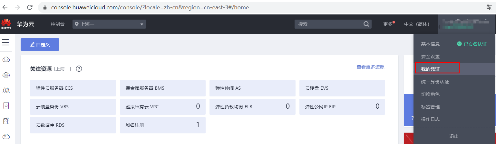
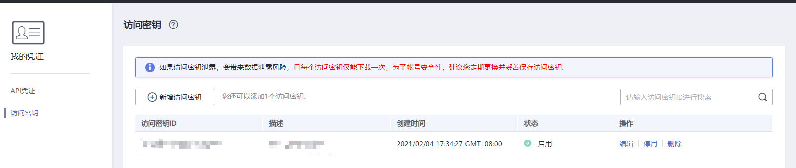

# AK/SK认证

使用服务API需要进行认证，目前SDK仅支持AK/SK认证方式。

使用AK/SK方式，需要用户提供AK和SK。

1.  注册并登录华为云管理控制台。
2.  在控制台中，鼠标移动至右上角的用户名处，在下拉列表中单击“我的凭证”。

    

3.  单击“访问秘钥”页签，在页签中，单击“新增访问秘钥”。

    

4.  在“身份验证“对话框中，输入当前用户的登录密码，通过邮箱或者手机进行验证，输入对应的验证码。
5.  单击“确定”，下载认证帐号的AK/SK，请妥善保管AK/SK信息。

