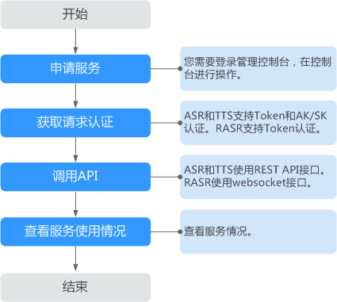

# 开通服务

语音交互服务提供了Web化的服务管理平台，即管理控制台。用户可在管理控制台进行申请公测和申请开通服务。

## 前提条件

申请华为云账号，并完成实名认证。

## 操作场景

用户第一次使用语音交互服务时，需要先申请公测/申请开通服务。服务只需要开通一次即可，后面使用时无需再申请。

## 服务使用流程

**图 1**  服务使用流程介绍  

1.  通过管理控制台申请服务。

    1.  登录华为云，单击右上角的“控制台“，进入“管理控制台“界面。
    2.  在服务列表中选择“EI企业智能 \> 语音交互服务“。
    3.  在语音交互服务主页，单击左侧导航栏子服务名称（如“短语音识别“）进入管理控制台。
    4.  处于公测阶段的服务，如果有“申请公测”按钮，单击“申请公测“，进行服务公测申请。
    5.  处于商用阶段的服务，如果有“申请服务”按钮，单击“申请服务“。

    > **说明：**   
    >-   审核通过后，若服务无法使用，请注销帐户后重新登录，即可开始使用。  
    >-   如需同时申请多个服务，选择相应服务后，单击“批量申请公测”。  
    >-   公测审批当前是人工审批，一般需要等待1\~2天，如遇节假日顺延。  

2.  使用API前，先获取请求认证。

    短语音识别和语音合成使用REST API接口，支持Token认证和AK/SK认证。实时语音转写使用websocket接口，支持Token认证一种认证鉴权方式。

    -   Token认证：通过Token认证调用请求。
    -   AK/SK认证：通过AK/SK加密调用请求。AK/SK认证安全性更高。

    具体操作请参见《API参考》的[认证鉴权](https://support.huaweicloud.com/api-sis/sis_03_0058.html)章节。

3.  调用API实现业务应用。

    短语音识别、语音合成、一句话识别、录音文件识别、定制语音合成使用REST API接口，实时语音转写使用websocket接口，调用API具体操作请参见[API参考](https://support.huaweicloud.com/api-sis/sis_03_0002.html)。

