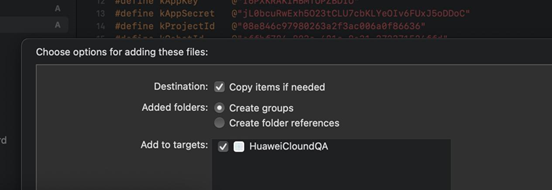
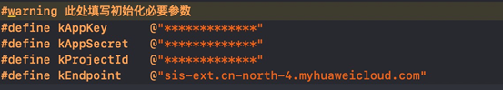

# 配置IOS\(OC\)环境<a name="ZH-CN_TOPIC_0000001165167602"></a>

1.  配置环境。

    在使用语音交互SDK时，需要准备的环境请参见[表 开发环境](#table1541153911415)。

    **表 1**  开发环境

    <a name="table1541153911415"></a>
    <table><thead align="left"><tr id="row2541739134112"><th class="cellrowborder" valign="top" width="18.56%" id="mcps1.2.3.1.1"><p id="p15411639184117"><a name="p15411639184117"></a><a name="p15411639184117"></a>准备项</p>
    </th>
    <th class="cellrowborder" valign="top" width="81.44%" id="mcps1.2.3.1.2"><p id="p05418395419"><a name="p05418395419"></a><a name="p05418395419"></a>说明</p>
    </th>
    </tr>
    </thead>
    <tbody><tr id="row7541123904111"><td class="cellrowborder" valign="top" width="18.56%" headers="mcps1.2.3.1.1 "><p id="p175411439134113"><a name="p175411439134113"></a><a name="p175411439134113"></a>操作系统</p>
    </td>
    <td class="cellrowborder" valign="top" width="81.44%" headers="mcps1.2.3.1.2 "><p id="p12541639144113"><a name="p12541639144113"></a><a name="p12541639144113"></a>Mac系统，推荐macOS10.12.6及以上版本,IOS 9.0 以上。</p>
    </td>
    </tr>
    <tr id="row1354119395419"><td class="cellrowborder" valign="top" width="18.56%" headers="mcps1.2.3.1.1 "><p id="p115412399415"><a name="p115412399415"></a><a name="p115412399415"></a>开发工具</p>
    </td>
    <td class="cellrowborder" valign="top" width="81.44%" headers="mcps1.2.3.1.2 "><p id="p454193914410"><a name="p454193914410"></a><a name="p454193914410"></a>Xcode，请到App Store应用市场下载</p>
    </td>
    </tr>
    </tbody>
    </table>

2.  将SDK包解压后可得到对应的HuaweiCloundSDKSIS.framework，

    其中模拟器+真机为开发者在开发时调试用，上架App Store请使用真机内的framework

3.  将framework直接拖入工程中并勾选如下

    

4.  导入后再在工程中引入SDK的头文件

    ```
    #import <HuaweiCloundSDKSIS/HuaweiCloundSDKSIS.h>
    ```

5.  定义ak、sk、projectId、endpoint，即可使用业务功能



