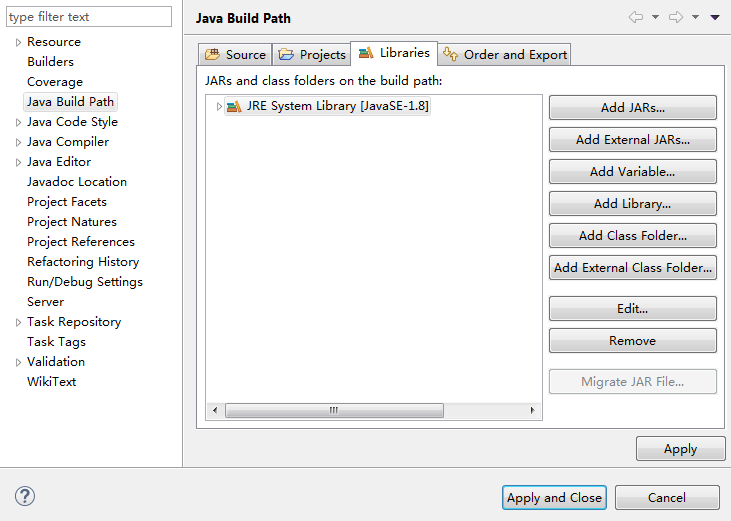

# 配置Java环境

1.  配置环境。

    在使用语音交互SDK时，需要准备的环境请参见[表 开发环境](#table330912111514)。

    **表 1**  开发环境

    
    <table><thead align="left"><tr id="row8310119153"><th class="cellrowborder" valign="top" width="50%" id="mcps1.2.3.1.1">
准备项

    </th>
    <th class="cellrowborder" valign="top" width="50%" id="mcps1.2.3.1.2">
说明

    </th>
    </tr>
    </thead>
    <tbody><tr id="row23100114150"><td class="cellrowborder" valign="top" width="50%" headers="mcps1.2.3.1.1 ">
操作系统

    </td>
    <td class="cellrowborder" valign="top" width="50%" headers="mcps1.2.3.1.2 ">
Windows系统，推荐Windows 7及以上版本。

    </td>
    </tr>
    <tr id="row3310111153"><td class="cellrowborder" valign="top" width="50%" headers="mcps1.2.3.1.1 ">
JDK

    </td>
    <td class="cellrowborder" valign="top" width="50%" headers="mcps1.2.3.1.2 ">
Java开发环境的基本配置。版本要求：强烈推荐使用1.8版本。

    </td>
    </tr>
    <tr id="row63104116153"><td class="cellrowborder" valign="top" width="50%" headers="mcps1.2.3.1.1 ">
Eclipse

    </td>
    <td class="cellrowborder" valign="top" width="50%" headers="mcps1.2.3.1.2 ">
在<a href="https://www.eclipse.org/downloads/packages/" target="_blank" rel="noopener noreferrer">Eclipse官网</a>下载对应平台的Eclipse版本，比如：eclipse-jee-mars-R-win32-x86_64.zip。

    </td>
    </tr>
    </tbody>
    </table>

2.  Eclipse导入SDK。
    1.  解压eclipse后，直接打开。
    2.  Window -\> Preferences -\> Java -\> installed JREs配置正确的JRE路径。
    3.  新建工程，在工程下建立一个文件（New -\> Folder），命名为lib。将下载的jar包拷贝至lib中。
    4.  右单击工程，选择Build Path -\> Configure Build Path –\> 选择Libraries -\> 选择Add JARs。 在打开的窗口选择刚放进lib的jar包。点击OK，至此导入完成。

        

